# Lede Program 2023 Personal Projects Test Page

Quick checks to make sure our pages are looking their best.

<table><tr><td><a href="#federicodtgithubio"> federicodt.github.io</a></td>
<td><a href="#aishyvgithubio"> aishyv.github.io</a></td>
<td><a href="#alichekgithubio"> alichek.github.io</a></td>
<td><a href="#alliekrugmangithubio"> alliekrugman.github.io</a></td>
</tr><tr>
<td><a href="#anaeazpuruagithubio"> anaeazpurua.github.io</a></td>
<td><a href="#ann2128githubio">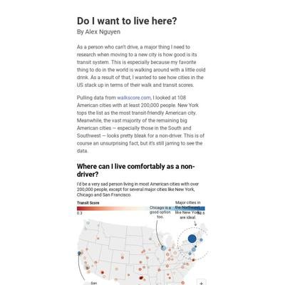 ann2128.github.io</a></td>
<td><a href="#bennett-gpjgithubio"> bennett-gpj.github.io</a></td>
<td><a href="#bique2002githubio"> bique2002.github.io</a></td>
</tr><tr>
<td><a href="#celyvelezgithubio"> celyvelez.github.io</a></td>
<td><a href="#colvapgithubio">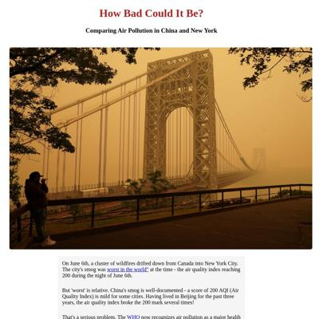 colvap.github.io</a></td>
<td><a href="#coralmurphy3githubio"> coralmurphy3.github.io</a></td>
<td><a href="#cristinadelmargithubio"> cristinadelmar.github.io</a></td>
</tr><tr>
<td><a href="#davidmhorowitzgithubio"> davidmhorowitz.github.io</a></td>
<td><a href="#eculliford1githubio"> eculliford1.github.io</a></td>
<td><a href="#efkodongithubio"> efkodon.github.io</a></td>
<td><a href="#federicodtgithubio"> federicodt.github.io</a></td>
</tr><tr>
<td><a href="#gavaglianogithubio">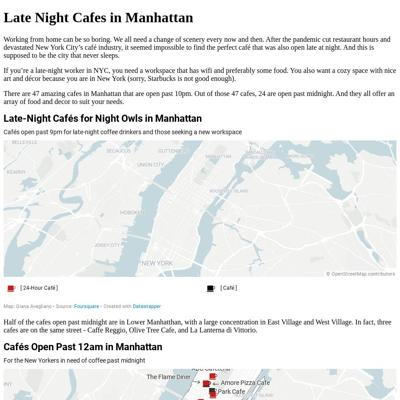 gavagliano.github.io</a></td>
<td><a href="#githubcom">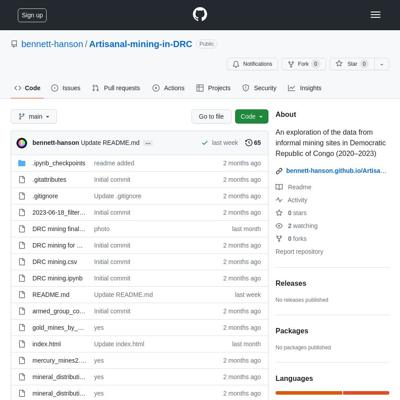 github.com</a></td>
<td><a href="#hannaakanggithubio"> hannaakang.github.io</a></td>
<td><a href="#idontknowhowcomputersworkgithubio"> idontknowhowcomputerswork.github.io</a></td>
</tr><tr>
<td><a href="#jellomoatgithubio"> jellomoat.github.io</a></td>
<td>juditecypreste.com request failed</td>
<td><a href="#karinashedgithubio"> karinashed.github.io</a></td>
<td><a href="#kesa-wgithubio"> kesa-w.github.io</a></td>
</tr><tr>
<td><a href="#krlmnzgithubio"> krlmnz.github.io</a></td>
<td><a href="#krystalwongithubio">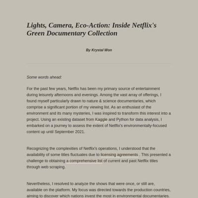 krystalwon.github.io</a></td>
<td><a href="#ligea-alexandergithubio"> ligea-alexander.github.io</a></td>
<td><a href="#marcodallastellagithubio"> marcodallastella.github.io</a></td>
</tr><tr>
<td><a href="#margauxwritesgithubio"> margauxwrites.github.io</a></td>
<td><a href="#marinav13githubio"> marinav13.github.io</a></td>
<td><a href="#medievalmadelinegithubio"> medievalmadeline.github.io</a></td>
<td><a href="#meganmkimgithubio"> meganmkim.github.io</a></td>
</tr><tr>
<td><a href="#mfhangithubio"> mfhan.github.io</a></td>
<td><a href="#mizuhomoriokagithubio"> mizuhomorioka.github.io</a></td>
<td><a href="#mollylongmangithubio"> mollylongman.github.io</a></td>
<td><a href="#muimrangithubio"> muimran.github.io</a></td>
</tr><tr>
<td><a href="#mymo5303githubio"> mymo5303.github.io</a></td>
<td><a href="#nam-sgn327githubio"> nam-sgn327.github.io</a></td>
<td><a href="#namu-sampathgithubio"> namu-sampath.github.io</a></td>
<td><a href="#nguyenkimca"> nguyenkim.ca</a></td>
</tr><tr>
<td><a href="#niallsimoniangithubio"> niallsimonian.github.io</a></td>
<td><a href="#prachivashishttgithubio"> prachivashishtt.github.io</a></td>
<td><a href="#rajitsenguptagithubio"> rajitsengupta.github.io</a></td>
<td><a href="#reliablerascalgithubio"> reliablerascal.github.io</a></td>
</tr><tr>
<td><a href="#retrospatialgithubio"> retrospatial.github.io</a></td>
<td><a href="#scatterplotsandteagithubio"> scatterplotsandtea.github.io</a></td>
<td><a href="#seulgijunggithubio"> seulgijung.github.io</a></td>
<td><a href="#sho-miyasakagithubio"> sho-miyasaka.github.io</a></td>
</tr><tr>
<td><a href="#sinderskirgithubio"> sinderskir.github.io</a></td>
<td><a href="#tejalwakchouregithubio"> tejalwakchoure.github.io</a></td>
<td><a href="#unoptimalgithubio"> unoptimal.github.io</a></td>
<td><a href="#winter-beardgithubio"> winter-beard.github.io</a></td>
</tr><tr>
<td><a href="#yikematsgithubio"> yikemats.github.io</a></td>
</tr></table>

## federicodt.github.io

|url|mobile|medium|wide|
|---|---|---|---|
|[The illegal flights of the first lady of Argentina, during the Pandemic lockdown](http://federicodt.github.io/project1/)||||

### Automatic Checks

**http://federicodt.github.io/project1/**

* Has sideways scrollbars in mobile version – check padding, margins, image widths

## aishyv.github.io

|url|mobile|medium|wide|
|---|---|---|---|
|[Darshinis of Bangalore](https://aishyv.github.io/darshini-names/) :x: og:title :x: og:description :x: og:image [how to fix](https://jonathansoma.com/everything/web/social-tags/)||||
|[Credit where it’s due, unless you’re a singer](https://aishyv.github.io/missing-singers/) :x: og:title :x: og:description :x: og:image [how to fix](https://jonathansoma.com/everything/web/social-tags/)||||

### Automatic Checks

**https://aishyv.github.io/darshini-names/**

* Has sideways scrollbars in mobile version – check padding, margins, image widths

**https://aishyv.github.io/missing-singers/**

* Image(s) need `alt` tags, [info here](https://abilitynet.org.uk/news-blogs/five-golden-rules-compliant-alt-text) and [tips here](https://twitter.com/FrankElavsky/status/1469023374529765385)
    * Image `image2.png` missing `alt` tag
    * Image `image.png` missing `alt` tag

## alichek.github.io

|url|mobile|medium|wide|
|---|---|---|---|
|[Alec Gitelman Lede Project 1 - Watching the Bird Watchers](https://alichek.github.io/There-will-be-birds/) :x: og:title :x: og:description :x: og:image [how to fix](https://jonathansoma.com/everything/web/social-tags/)||||

### Automatic Checks

**https://alichek.github.io/There-will-be-birds/**

* Change URL to be all in lowercase

## alliekrugman.github.io

|url|mobile|medium|wide|
|---|---|---|---|
|[Organ donation needs a bigger heart](https://alliekrugman.github.io/left-my-heart/) :x: og:title :x: og:description :x: og:image [how to fix](https://jonathansoma.com/everything/web/social-tags/)||||
|[Trouble breathing at California’s border](https://alliekrugman.github.io/trouble-breathing/) :x: og:title :x: og:description :x: og:image [how to fix](https://jonathansoma.com/everything/web/social-tags/)||||

### Automatic Checks

**https://alliekrugman.github.io/left-my-heart/**

No issues found! 🎉

**https://alliekrugman.github.io/trouble-breathing/**

* Overlapping elements in ai2html, check [the overflow video](https://www.youtube.com/watch?v=6vHsnjTp3_w) or make a smaller size
   * Text `Thin air` overlaps with `The closer to California's U.S.-Mexico border, the worse the air quality. Popular crossing` at screen width 400
   * Text `The closer to California's U.S.-Mexico border, the worse the air quality. Popular crossing` overlaps with `points San Ysidro and Calexico have the highest air pollution levels in the region.` at screen width 400
   * Text `Calexico` overlaps with `Lorem ipsum` at screen width 400
* Missing font(s), you might need web fonts – [text explanation](https://gist.github.com/jsoma/631621e0807b26d49f5aef5260f79162), [video explanation](https://www.youtube.com/watch?v=HNhIeb_jEYM&list=PLewNEVDy7gq3MSrrO3eMEW8PhGMEVh2X2&index=3)
    * `Knowledge, "Source Sans Pro", Arial, sans-serif` font not found, used in 17 text objects. Example: _Thin air, The closer to California's U.S.-Mexico border, the worse the air quality. Popular crossing, points San Ysidro and Calexico have the highest air pollution levels in the region._

## anaeazpurua.github.io

|url|mobile|medium|wide|
|---|---|---|---|
|[What did Tom Hanks & Oprah told recent graduates? These are the words they chos](https://anaeazpurua.github.io/graduation_speeches/) :x: og:title :x: og:description :x: og:image [how to fix](https://jonathansoma.com/everything/web/social-tags/)|||[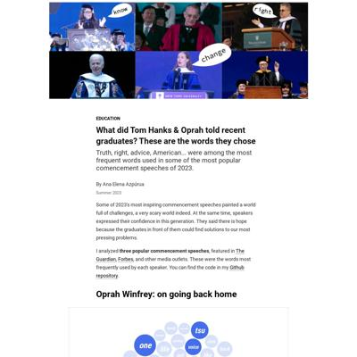](screenshots/anaeazpurua.github.io/graduation_speeches_index.html-wide-full.jpg)|
|[Banking on Nostalgia](https://anaeazpurua.github.io/project_one/) :x: og:title :x: og:description :x: og:image [how to fix](https://jonathansoma.com/everything/web/social-tags/)||||

### Automatic Checks

**https://anaeazpurua.github.io/graduation_speeches/**

* Add a link to your project's GitHub repo, so people can review your code
* Change URL to use `-` instead of spaces or underscores
* Has sideways scrollbars in mobile version – check padding, margins, image widths
* Minimum font size should be 12px, enlarge text in Illustrator
    * Text `9` is too small at 10px
    * Text `8` is too small at 10px
    * Text `9` is too small at 10px
    * Text `7` is too small at 10px
    * Text `7` is too small at 10px
    * Text `7` is too small at 10px
    * Text `10` is too small at 10px
    * *and 12 more*
* Overlapping elements in ai2html, check [the overflow video](https://www.youtube.com/watch?v=6vHsnjTp3_w) or make a smaller size
   * Text `father` overlaps with `class` at screen width 900
   * Text `father` overlaps with `class` at screen width 1300

**https://anaeazpurua.github.io/project_one/**

* Change URL to use `-` instead of spaces or underscores
* Minimum font size should be 12px, enlarge text in Illustrator
    * Text `Visit with my parents` is too small at 10px
    * Text `Visit with my kids` is too small at 10px
    * Text `1993` is too small at 10px
    * Text `2023` is too small at 10px
    * Text `New ` is too small at 10px
    * Text `attractions` is too small at 10px
    * Text `Magic Kingdom ` is too small at 10px
    * *and 95 more*
* Overlapping elements in ai2html, check [the overflow video](https://www.youtube.com/watch?v=6vHsnjTp3_w) or make a smaller size
   * Text `1970` overlaps with `1975` at screen width 400
   * Text `1975` overlaps with `1980` at screen width 400
   * Text `1980` overlaps with `1985` at screen width 400
   * Text `1985` overlaps with `1990` at screen width 400
   * Text `1990` overlaps with `1995` at screen width 400
   * Text `1995` overlaps with `2000` at screen width 400
   * Text `2000` overlaps with `2005` at screen width 400
   * *and 30 more*

## ann2128.github.io

|url|mobile|medium|wide|
|---|---|---|---|
|[Do I want to live here?](https://ann2128.github.io/city_walkability.html) :x: og:title :x: og:description :x: og:image [how to fix](https://jonathansoma.com/everything/web/social-tags/)||||
|[Mapping Community Gardens](https://ann2128.github.io/nyc_community_gardens) :x: og:title :x: og:description :x: og:image [how to fix](https://jonathansoma.com/everything/web/social-tags/)|||[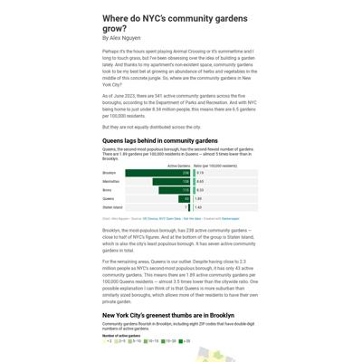](screenshots/ann2128.github.io/nyc_community_gardens_index.html-wide-full.jpg)|

### Automatic Checks

**https://ann2128.github.io/city_walkability.html**

* All HTML files should be named `index.html`. If this is a personal project, move `city_walkability.html` into a folder (or repo) called `city_walkability`, then rename the file `index.html`. That way the project can be found at **/city_walkability** instead of **/city_walkability.html**. [Read more about index.html here](https://www.thoughtco.com/index-html-page-3466505) or how it works specifically with GitHub repos [on Fancy GitHub](https://jonathansoma.com/fancy-github/github-pages/#choosing-your-url)
* Image(s) need `alt` tags, [info here](https://abilitynet.org.uk/news-blogs/five-golden-rules-compliant-alt-text) and [tips here](https://twitter.com/FrankElavsky/status/1469023374529765385)
    * Image `texas-chart.jpg` missing `alt` tag
* Change URL to use `-` instead of spaces or underscores

**https://ann2128.github.io/nyc_community_gardens**

* Change URL to use `-` instead of spaces or underscores
* Has sideways scrollbars in mobile version – check padding, margins, image widths

## bennett-gpj.github.io

|url|mobile|medium|wide|
|---|---|---|---|
|[Gangs-and-Displacement-in-Haiti](https://bennett-gpj.github.io/Gangs-and-Displacement-in-Haiti/) :x: og:title :x: og:description :x: og:image [how to fix](https://jonathansoma.com/everything/web/social-tags/)||||
|[Gangs-and-Displacement-in-Haiti](https://bennett-gpj.github.io/Gangs-and-Displacement-in-Haiti/) :x: og:title :x: og:description :x: og:image [how to fix](https://jonathansoma.com/everything/web/social-tags/)||||

### Automatic Checks

**https://bennett-gpj.github.io/Gangs-and-Displacement-in-Haiti/**

* Change URL to be all in lowercase
* Has sideways scrollbars in mobile version – check padding, margins, image widths

**https://bennett-gpj.github.io/Gangs-and-Displacement-in-Haiti/**

* Change URL to be all in lowercase
* Has sideways scrollbars in mobile version – check padding, margins, image widths

## bique2002.github.io

|url|mobile|medium|wide|
|---|---|---|---|
|[Road Fatality Statistics](https://bique2002.github.io/LEDE-P1-Road-Fatalities-2018/) :x: og:title :x: og:description :x: og:image [how to fix](https://jonathansoma.com/everything/web/social-tags/)||||

### Automatic Checks

**https://bique2002.github.io/LEDE-P1-Road-Fatalities-2018/**

* Image(s) need `alt` tags, [info here](https://abilitynet.org.uk/news-blogs/five-golden-rules-compliant-alt-text) and [tips here](https://twitter.com/FrankElavsky/status/1469023374529765385)
    * Image `Images/road-accidents.jpg` missing `alt` tag
    * Image `2018 Drivers Killed.png` missing `alt` tag
* Change URL to be all in lowercase
* Missing viewport meta tag in `<head>`, needed to tell browser it's responsive. Add `<meta name="viewport" content="width=device-width, initial-scale=1, shrink-to-fit=no">`
* Has sideways scrollbars in mobile version – check padding, margins, image widths

## celyvelez.github.io

|url|mobile|medium|wide|
|---|---|---|---|
|[Sara Cely - Lede Project 01](https://celyvelez.github.io/lede-2023/project-01/) :x: og:title :x: og:description :x: og:image [how to fix](https://jonathansoma.com/everything/web/social-tags/)||||
|[Page not found · GitHub Pages](https://celyvelez.github.io/Lede/Project%2002/colombian-bills-2018-2022.html) :x: og:title :x: og:description :x: og:image [how to fix](https://jonathansoma.com/everything/web/social-tags/)|request failed|request failed|request failed|

### Automatic Checks

**https://celyvelez.github.io/lede-2023/project-01/**

No issues found! 🎉

**https://celyvelez.github.io/Lede/Project%2002/colombian-bills-2018-2022.html**

* **Could not access the page** - if you moved it, let me know!
* All HTML files should be named `index.html`. If this is a personal project, move `Lede/Project%2002/colombian-bills-2018-2022.html` into a folder (or repo) called `colombian-bills-2018-2022`, then rename the file `index.html`. That way the project can be found at **/colombian-bills-2018-2022** instead of **/colombian-bills-2018-2022.html**. [Read more about index.html here](https://www.thoughtco.com/index-html-page-3466505) or how it works specifically with GitHub repos [on Fancy GitHub](https://jonathansoma.com/fancy-github/github-pages/#choosing-your-url)
* Change URL to be all in lowercase
* Missing viewport meta tag in `<head>`, needed to tell browser it's responsive. Add `<meta name="viewport" content="width=device-width, initial-scale=1, shrink-to-fit=no">`
* Has sideways scrollbars in mobile version – check padding, margins, image widths

## colvap.github.io

|url|mobile|medium|wide|
|---|---|---|---|
|[How Bad Could It Be?](https://colvap.github.io/Lede-Program-2023---Air-Pollution-New-York-vs-China/) :x: og:title :x: og:description :x: og:image [how to fix](https://jonathansoma.com/everything/web/social-tags/)||||
|[How England Prefers its Princesses](https://colvap.github.io/Project-2-/) :x: og:title :x: og:description :x: og:image [how to fix](https://jonathansoma.com/everything/web/social-tags/)||[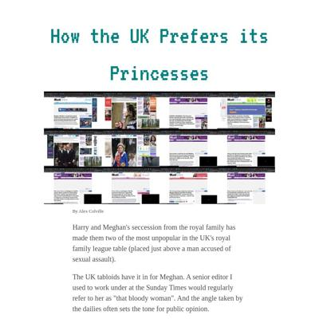](screenshots/colvap.github.io/Project-2-_index.html-medium-full.jpg)|[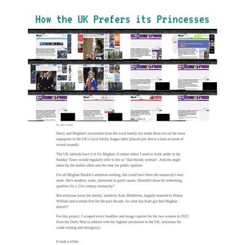](screenshots/colvap.github.io/Project-2-_index.html-wide-full.jpg)|

### Automatic Checks

**https://colvap.github.io/Lede-Program-2023---Air-Pollution-New-York-vs-China/**

* Image(s) need `alt` tags, [info here](https://abilitynet.org.uk/news-blogs/five-golden-rules-compliant-alt-text) and [tips here](https://twitter.com/FrankElavsky/status/1469023374529765385)
    * Image `smog2.jpeg` missing `alt` tag
* Change URL to be all in lowercase
* Has sideways scrollbars in mobile version – check padding, margins, image widths

**https://colvap.github.io/Project-2-/**

* Image(s) need `alt` tags, [info here](https://abilitynet.org.uk/news-blogs/five-golden-rules-compliant-alt-text) and [tips here](https://twitter.com/FrankElavsky/status/1469023374529765385)
    * Image `grid-0.png` missing `alt` tag
    * Image `animate.gif` missing `alt` tag
    * Image `kate.png` missing `alt` tag
    * Image `Meghan.png` missing `alt` tag
* Change URL to be all in lowercase
* Missing viewport meta tag in `<head>`, needed to tell browser it's responsive. Add `<meta name="viewport" content="width=device-width, initial-scale=1, shrink-to-fit=no">`

## coralmurphy3.github.io

|url|mobile|medium|wide|
|---|---|---|---|
|[The Untold Stories Behind Manatí's Roads](https://coralmurphy3.github.io/manati/) :x: og:title :x: og:description :x: og:image [how to fix](https://jonathansoma.com/everything/web/social-tags/)||||
|[Project 1](https://coralmurphy3.github.io/Project-1) :x: og:title :x: og:description :x: og:image [how to fix](https://jonathansoma.com/everything/web/social-tags/)||||

### Automatic Checks

**https://coralmurphy3.github.io/manati/**

* Has sideways scrollbars in mobile version – check padding, margins, image widths

**https://coralmurphy3.github.io/Project-1**

* Add a link to your project's GitHub repo, so people can review your code
* Change URL to be all in lowercase
* Has sideways scrollbars in mobile version – check padding, margins, image widths

## cristinadelmar.github.io

|url|mobile|medium|wide|
|---|---|---|---|
|[So do you want to go to the beach?](https://cristinadelmar.github.io/beaches-and-enterococci/) :x: og:title :x: og:description :x: og:image [how to fix](https://jonathansoma.com/everything/web/social-tags/)||||
|[No Park to Go](https://cristinadelmar.github.io/parks-recovery-puerto-rico/) :x: og:title :x: og:description :x: og:image [how to fix](https://jonathansoma.com/everything/web/social-tags/)||[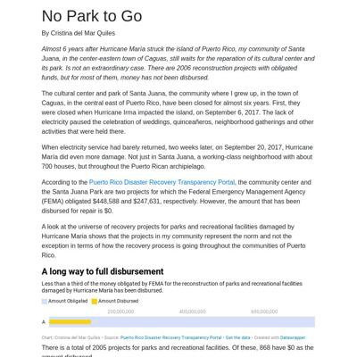](screenshots/cristinadelmar.github.io/parks-recovery-puerto-rico_index.html-medium-full.jpg)||

### Automatic Checks

**https://cristinadelmar.github.io/beaches-and-enterococci/**

No issues found! 🎉

**https://cristinadelmar.github.io/parks-recovery-puerto-rico/**

No issues found! 🎉

## davidmhorowitz.github.io

|url|mobile|medium|wide|
|---|---|---|---|
|[New community college teachers in the East Bay pay nearly half of their income to rent where they teach](https://davidmhorowitz.github.io/HTML-youtube-folder/) :x: og:title :x: og:description :x: og:image [how to fix](https://jonathansoma.com/everything/web/social-tags/)|||[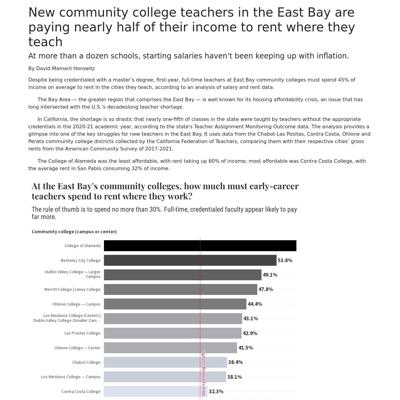](screenshots/davidmhorowitz.github.io/HTML-youtube-folder_index.html-wide-full.jpg)|
|[What are people typing when they file public records requests with San Francisco?](https://davidmhorowitz.github.io/Lede_Project-2_Counting-words-on-NextRequest/) :x: og:title :x: og:description :x: og:image [how to fix](https://jonathansoma.com/everything/web/social-tags/)||||

### Automatic Checks

**https://davidmhorowitz.github.io/HTML-youtube-folder/**

* Add a link to your project's GitHub repo, so people can review your code
* Change URL to be all in lowercase

**https://davidmhorowitz.github.io/Lede_Project-2_Counting-words-on-NextRequest/**

* Add a link to your project's GitHub repo, so people can review your code
* Change URL to use `-` instead of spaces or underscores
* Change URL to be all in lowercase

## eculliford1.github.io

|url|mobile|medium|wide|
|---|---|---|---|
|[Elizabeth Culliford Project 2 Sleep](https://eculliford1.github.io/Project-2/) :x: og:title :x: og:description :x: og:image [how to fix](https://jonathansoma.com/everything/web/social-tags/)|||[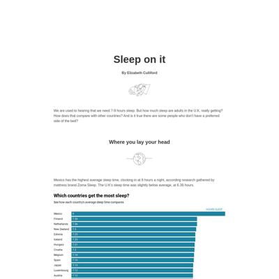](screenshots/eculliford1.github.io/Project-2_index.html-wide-full.jpg)|
|[Elizabeth Culliford Project 1 Pubs](https://eculliford1.github.io/pubs11) :x: og:title :x: og:description :x: og:image [how to fix](https://jonathansoma.com/everything/web/social-tags/)|||[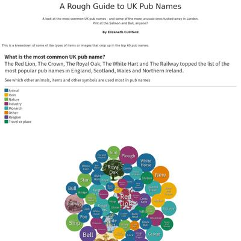](screenshots/eculliford1.github.io/pubs11_index.html-wide-full.jpg)|

### Automatic Checks

**https://eculliford1.github.io/Project-2/**

* Add a link to your project's GitHub repo, so people can review your code
* Image(s) need `alt` tags, [info here](https://abilitynet.org.uk/news-blogs/five-golden-rules-compliant-alt-text) and [tips here](https://twitter.com/FrankElavsky/status/1469023374529765385)
    * Image `https://img.freepik.com/premium-vector/continuous-line-drawing-sleeping-young-woman-lies-bed-with-eyes-closed_497857-308.jpg?w=2000` missing `alt` tag
    * Image `https://img.freepik.com/premium-vector/globe-earth-globe-one-line-drawing-world-map-minimalist-continuous-line-drawing_106796-2239.jpg?w=1060` missing `alt` tag
    * Image `https://static.vecteezy.com/system/resources/previews/002/781/318/non_2x/continuous-line-drawing-sofa-bed-illustration-vector.jpg` missing `alt` tag
    * Image `https://img.freepik.com/premium-vector/phone-line-background-one-line-drawing-background-smartphone-icon_118339-1012.jpg` missing `alt` tag
* Change URL to be all in lowercase
* Missing viewport meta tag in `<head>`, needed to tell browser it's responsive. Add `<meta name="viewport" content="width=device-width, initial-scale=1, shrink-to-fit=no">`
* Has sideways scrollbars in mobile version – check padding, margins, image widths

**https://eculliford1.github.io/pubs11**

* Add a link to your project's GitHub repo, so people can review your code
* Image(s) need `alt` tags, [info here](https://abilitynet.org.uk/news-blogs/five-golden-rules-compliant-alt-text) and [tips here](https://twitter.com/FrankElavsky/status/1469023374529765385)
    * Image `deptford.png` missing `alt` tag
* Missing viewport meta tag in `<head>`, needed to tell browser it's responsive. Add `<meta name="viewport" content="width=device-width, initial-scale=1, shrink-to-fit=no">`

## efkodon.github.io

|url|mobile|medium|wide|
|---|---|---|---|
|[Emily Keller-O'Donnell's Website](https://efkodon.github.io/va-internet) :x: og:title :x: og:description :x: og:image [how to fix](https://jonathansoma.com/everything/web/social-tags/)|||[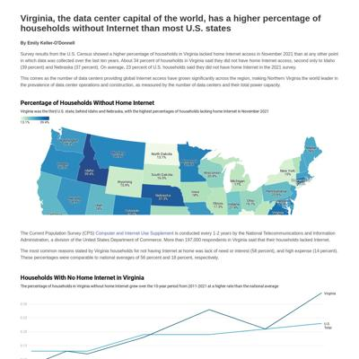](screenshots/efkodon.github.io/va-internet_index.html-wide-full.jpg)|
|[Emily Keller-O'Donnell's project 2](https://efkodon.github.io/wa-schools-seismic/) :x: og:title :x: og:description :x: og:image [how to fix](https://jonathansoma.com/everything/web/social-tags/)||||

### Automatic Checks

**https://efkodon.github.io/va-internet**

No issues found! 🎉

**https://efkodon.github.io/wa-schools-seismic/**

No issues found! 🎉

## federicodt.github.io

|url|mobile|medium|wide|
|---|---|---|---|
|[Are rats still a problem?](https://federicodt.github.io/nyc-rat-health-problem/)||||

### Automatic Checks

**https://federicodt.github.io/nyc-rat-health-problem/**

* Has sideways scrollbars in mobile version – check padding, margins, image widths

## gavagliano.github.io

|url|mobile|medium|wide|
|---|---|---|---|
|[Giana Avagliano's Website](https://gavagliano.github.io/Project-1/) :x: og:title :x: og:description :x: og:image [how to fix](https://jonathansoma.com/everything/web/social-tags/)||||

### Automatic Checks

**https://gavagliano.github.io/Project-1/**

* Add a link to your project's GitHub repo, so people can review your code
* Change URL to be all in lowercase
* Missing viewport meta tag in `<head>`, needed to tell browser it's responsive. Add `<meta name="viewport" content="width=device-width, initial-scale=1, shrink-to-fit=no">`

## github.com

|url|mobile|medium|wide|
|---|---|---|---|
|[GitHub - bennett-gpj/Artisanal-mining-in-DRC: An exploration of the data from informal mining sites in Democratic Republic of Congo (2020–2023)](https://github.com/bennett-gpj/Artisanal-mining-in-DRC/tree/main)||||
|[GitHub - kesa-w/Lede2023.P1](https://github.com/kesa-w/Lede2023.P1.git)||[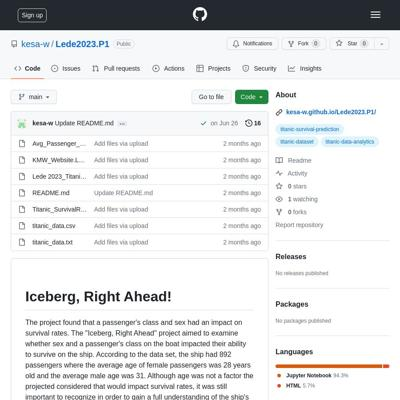](screenshots/github.com/kesa-w_Lede2023.P1.git_index.html-medium-full.jpg)||
|[GitHub - krlmnz/chile: Overview of Chilean trade and land used](https://github.com/krlmnz/Chile)||||
|[Page not found · GitHub · GitHub](https://github.com/pilartms/rape-data)|request failed|request failed|request failed|

### Automatic Checks

**https://github.com/bennett-gpj/Artisanal-mining-in-DRC/tree/main**

* Change URL to be all in lowercase

**https://github.com/kesa-w/Lede2023.P1.git**

* Change URL to be all in lowercase

**https://github.com/krlmnz/Chile**

* Change URL to be all in lowercase

**https://github.com/pilartms/rape-data**

* **Could not access the page** - if you moved it, let me know!
* Has sideways scrollbars in mobile version – check padding, margins, image widths

## hannaakang.github.io

|url|mobile|medium|wide|
|---|---|---|---|
|[Los Angeles 1992 Riot Deaths](https://hannaakang.github.io/riot-deaths/) :x: og:title :x: og:description :x: og:image [how to fix](https://jonathansoma.com/everything/web/social-tags/)||||

### Automatic Checks

**https://hannaakang.github.io/riot-deaths/**

* Has sideways scrollbars in mobile version – check padding, margins, image widths

## idontknowhowcomputerswork.github.io

|url|mobile|medium|wide|
|---|---|---|---|
|[Website](https://idontknowhowcomputerswork.github.io/PROJECTS) :x: og:title :x: og:description :x: og:image [how to fix](https://jonathansoma.com/everything/web/social-tags/)|||[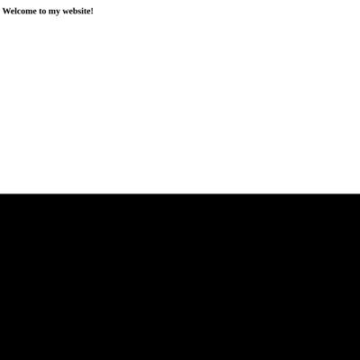](screenshots/idontknowhowcomputerswork.github.io/PROJECTS_index.html-wide-full.jpg)|

### Automatic Checks

**https://idontknowhowcomputerswork.github.io/PROJECTS**

* Add a link to your project's GitHub repo, so people can review your code
* Change URL to be all in lowercase
* Missing viewport meta tag in `<head>`, needed to tell browser it's responsive. Add `<meta name="viewport" content="width=device-width, initial-scale=1, shrink-to-fit=no">`

## jellomoat.github.io

|url|mobile|medium|wide|
|---|---|---|---|
|[subreddits: what the top subreddits say about us](https://jellomoat.github.io/subs/)|||[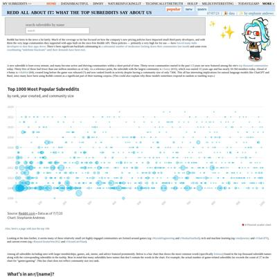](screenshots/jellomoat.github.io/subs_index.html-wide-full.jpg)|
|[Profiles of the Many Dramatically Different Yogurts at Whole Foods](https://jellomoat.github.io/yogurts/) :x: og:title :x: og:description :x: og:image [how to fix](https://jonathansoma.com/everything/web/social-tags/)||||

### Automatic Checks

**https://jellomoat.github.io/subs/**

* Has sideways scrollbars in mobile version – check padding, margins, image widths

**https://jellomoat.github.io/yogurts/**

* Missing viewport meta tag in `<head>`, needed to tell browser it's responsive. Add `<meta name="viewport" content="width=device-width, initial-scale=1, shrink-to-fit=no">`

## juditecypreste.com

|url|mobile|medium|wide|
|---|---|---|---|
|[Page not found · GitHub Pages](https://juditecypreste.com/portfolio-lede/project_1/project_1.html) :x: og:title :x: og:description :x: og:image [how to fix](https://jonathansoma.com/everything/web/social-tags/)|request failed|request failed|request failed|
|[Pepper Pink Spray](https://juditecypreste.com/portfolio-lede/project-02/) :x: og:title :x: og:description :x: og:image [how to fix](https://jonathansoma.com/everything/web/social-tags/)||||

### Automatic Checks

**https://juditecypreste.com/portfolio-lede/project_1/project_1.html**

* **Could not access the page** - if you moved it, let me know!
* All HTML files should be named `index.html`. If this is a personal project, move `portfolio-lede/project_1/project_1.html` into a folder (or repo) called `project_1`, then rename the file `index.html`. That way the project can be found at **/project_1** instead of **/project_1.html**. [Read more about index.html here](https://www.thoughtco.com/index-html-page-3466505) or how it works specifically with GitHub repos [on Fancy GitHub](https://jonathansoma.com/fancy-github/github-pages/#choosing-your-url)
* Change URL to use `-` instead of spaces or underscores
* Missing viewport meta tag in `<head>`, needed to tell browser it's responsive. Add `<meta name="viewport" content="width=device-width, initial-scale=1, shrink-to-fit=no">`
* Has sideways scrollbars in mobile version – check padding, margins, image widths

**https://juditecypreste.com/portfolio-lede/project-02/**

* Minimum font size should be 12px, enlarge text in Illustrator
    * Text `IDEAL FOR` is too small at 9px
    * Text `PREVENTING` is too small at 9px
    * Text `VIOLENCE AGAINST` is too small at 9px
    * Text `WOMEN` is too small at 9px
* Overlapping elements in ai2html, check [the overflow video](https://www.youtube.com/watch?v=6vHsnjTp3_w) or make a smaller size
   * Text `FLOWERS AND CHOCOLATE?` overlaps with `Defense Spray` at screen width 400
   * Text `Defense Spray` overlaps with `An option all yours` at screen width 400
   * Text `Defense Spray` overlaps with `I PREFER SOMETHING THAT...` at screen width 400
   * Text `An option all yours` overlaps with `I PREFER SOMETHING THAT...` at screen width 400
   * Text `VIOLENCE AGAINST` overlaps with `DEFENDS` at screen width 400
   * Text `WOMEN` overlaps with `DEFENDS` at screen width 400
   * Text `HER` overlaps with `PROTECTS ME!` at screen width 400
   * *and 6 more*

## karinashed.github.io

|url|mobile|medium|wide|
|---|---|---|---|
|[NYC Taxi Riders Are Still Decent Tippers](https://karinashed.github.io/nyc-yellow-taxi-rides/) :x: og:title :x: og:description :x: og:image [how to fix](https://jonathansoma.com/everything/web/social-tags/)||||
|[Slang On The Charts](https://karinashed.github.io/slang-lyrics-project/) :x: og:title :x: og:description :x: og:image [how to fix](https://jonathansoma.com/everything/web/social-tags/)|[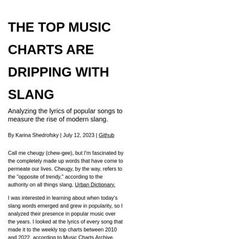](screenshots/karinashed.github.io/slang-lyrics-project_index.html-mobile-full.jpg)|||

### Automatic Checks

**https://karinashed.github.io/nyc-yellow-taxi-rides/**

No issues found! 🎉

**https://karinashed.github.io/slang-lyrics-project/**

* Has sideways scrollbars in mobile version – check padding, margins, image widths

## kesa-w.github.io

|url|mobile|medium|wide|
|---|---|---|---|
|[Nathans-Hotdogs  This shows the information for the first Nathan’s Hot Dog Competition all the way to the present](https://kesa-w.github.io/Nathans-Hotdogs) :x: og:image [how to fix](https://jonathansoma.com/everything/web/social-tags/)||||

### Automatic Checks

**https://kesa-w.github.io/Nathans-Hotdogs**

* Add a link to your project's GitHub repo, so people can review your code
* Image(s) need `alt` tags, [info here](https://abilitynet.org.uk/news-blogs/five-golden-rules-compliant-alt-text) and [tips here](https://twitter.com/FrankElavsky/status/1469023374529765385)
    * Image `https://www.rollingstone.com/wp-content/uploads/2023/07/HotDogContest-1.jpeg` missing `alt` tag
* Change URL to be all in lowercase
* Has sideways scrollbars in mobile version – check padding, margins, image widths

## krlmnz.github.io

|url|mobile|medium|wide|
|---|---|---|---|
|[Karol Munoz - Interwoven](https://krlmnz.github.io/Garment/) :x: og:title :x: og:description :x: og:image [how to fix](https://jonathansoma.com/everything/web/social-tags/)||||

### Automatic Checks

**https://krlmnz.github.io/Garment/**

* Add a link to your project's GitHub repo, so people can review your code
* Image(s) need `alt` tags, [info here](https://abilitynet.org.uk/news-blogs/five-golden-rules-compliant-alt-text) and [tips here](https://twitter.com/FrankElavsky/status/1469023374529765385)
    * Image `chart-1.png` missing `alt` tag
    * Image `chart-2.png` missing `alt` tag
* Change URL to be all in lowercase
* Missing viewport meta tag in `<head>`, needed to tell browser it's responsive. Add `<meta name="viewport" content="width=device-width, initial-scale=1, shrink-to-fit=no">`
* Has sideways scrollbars in mobile version – check padding, margins, image widths

## krystalwon.github.io

|url|mobile|medium|wide|
|---|---|---|---|
|[Data story with flourish](https://krystalwon.github.io/environmental-docus-in-netflix/) :x: og:title :x: og:description :x: og:image [how to fix](https://jonathansoma.com/everything/web/social-tags/)|||[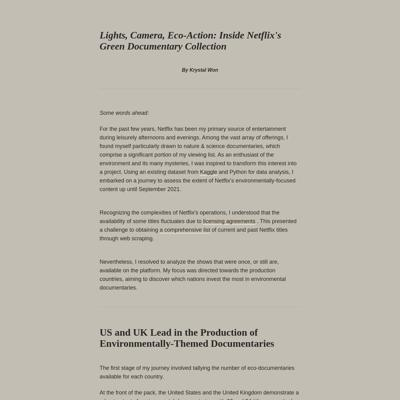](screenshots/krystalwon.github.io/environmental-docus-in-netflix_index.html-wide-full.jpg)|

### Automatic Checks

**https://krystalwon.github.io/environmental-docus-in-netflix/**

* Add a link to your project's GitHub repo, so people can review your code
* Has sideways scrollbars in mobile version – check padding, margins, image widths

## ligea-alexander.github.io

|url|mobile|medium|wide|
|---|---|---|---|
|[Millennials' Wine Adventures on a Budget](https://ligea-alexander.github.io/cellar-defenders/) :x: og:title :x: og:description :x: og:image [how to fix](https://jonathansoma.com/everything/web/social-tags/)||||
|[Project 2 Post-Mortem](https://ligea-alexander.github.io/the-cost-of-sunlight/) :x: og:title :x: og:description :x: og:image [how to fix](https://jonathansoma.com/everything/web/social-tags/)|||[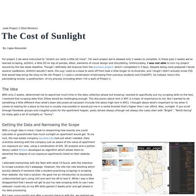](screenshots/ligea-alexander.github.io/the-cost-of-sunlight_index.html-wide-full.jpg)|
|[cost-of-sunlight-story/index.html](https://ligea-alexander.github.io/cost-of-sunlight-story/) :x: og:title :x: og:description :x: og:image [how to fix](https://jonathansoma.com/everything/web/social-tags/)|[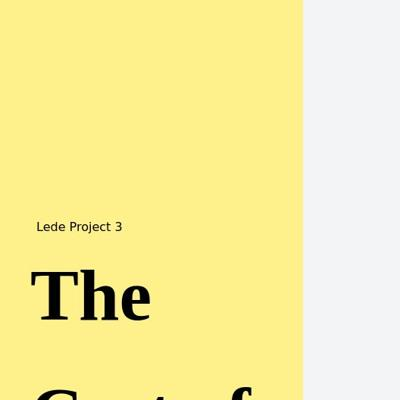](screenshots/ligea-alexander.github.io/cost-of-sunlight-story_index.html-mobile-full.jpg)||[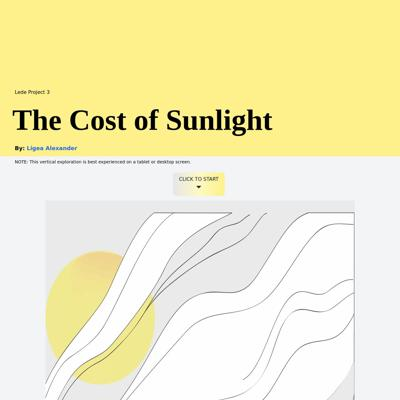](screenshots/ligea-alexander.github.io/cost-of-sunlight-story_index.html-wide-full.jpg)|

### Automatic Checks

**https://ligea-alexander.github.io/cellar-defenders/**

* Add a link to your project's GitHub repo, so people can review your code

**https://ligea-alexander.github.io/the-cost-of-sunlight/**

No issues found! 🎉

**https://ligea-alexander.github.io/cost-of-sunlight-story/**

* Needs a title, add a `<title>` tag to the `<head>`
* Has sideways scrollbars in mobile version – check padding, margins, image widths
* Minimum font size should be 12px, enlarge text in Illustrator
    * Text `householder with spouse` is too small at 7px
    * Text `57,057` is too small at 8px
    * Text `lives alone` is too small at 7px
    * Text `21,777` is too small at 8px
    * Text `householder with partner` is too small at 7px
    * Text `child of householder` is too small at 7px
    * Text `other relatives` is too small at 7px
    * *and 263 more*
* Overlapping elements in ai2html, check [the overflow video](https://www.youtube.com/watch?v=6vHsnjTp3_w) or make a smaller size
   * Text `Bright and` overlaps with `sun-drenched` at screen width 400
   * Text `Bright and` overlaps with `sun-drenched` at screen width 900
   * Text `Boreum Hill` overlaps with `11217` at screen width 1300
   * Text `Source:` overlaps with `Census Reporter` at screen width 1300
   * Text `Prospect Heights` overlaps with `11238` at screen width 1300
   * Text `Source:` overlaps with `Census Reporter` at screen width 1300
   * Text `Bright and` overlaps with `sun-drenched` at screen width 1300
   * *and 3 more*
* Missing font(s), you might need web fonts – [text explanation](https://gist.github.com/jsoma/631621e0807b26d49f5aef5260f79162), [video explanation](https://www.youtube.com/watch?v=HNhIeb_jEYM&list=PLewNEVDy7gq3MSrrO3eMEW8PhGMEVh2X2&index=3)
    * `"Helvetica Neue"` font not found, used in 93 text objects. Example: _As we stand here at the pinnacle of our journey, , the reality becomes clear—sunlight, a universal source of life, , has a cost in our urban landscape. _
    * `Impact` font not found, used in 16 text objects. Example: _Key:, Key:, Key:_

## marcodallastella.github.io

|url|mobile|medium|wide|
|---|---|---|---|
|[Forty years of Berlusconi in the headlines.](https://marcodallastella.github.io/articles/berlusconi.html) :x: og:title :x: og:description :x: og:image [how to fix](https://jonathansoma.com/everything/web/social-tags/)||||
|[Page not found · GitHub Pages](https://marcodallastella.github.io/swimming) :x: og:title :x: og:description :x: og:image [how to fix](https://jonathansoma.com/everything/web/social-tags/)|request failed|request failed|request failed|

### Automatic Checks

**https://marcodallastella.github.io/articles/berlusconi.html**

* All HTML files should be named `index.html`. If this is a personal project, move `articles/berlusconi.html` into a folder (or repo) called `berlusconi`, then rename the file `index.html`. That way the project can be found at **/berlusconi** instead of **/berlusconi.html**. [Read more about index.html here](https://www.thoughtco.com/index-html-page-3466505) or how it works specifically with GitHub repos [on Fancy GitHub](https://jonathansoma.com/fancy-github/github-pages/#choosing-your-url)
* Has sideways scrollbars in mobile version – check padding, margins, image widths

**https://marcodallastella.github.io/swimming**

* **Could not access the page** - if you moved it, let me know!
* Missing viewport meta tag in `<head>`, needed to tell browser it's responsive. Add `<meta name="viewport" content="width=device-width, initial-scale=1, shrink-to-fit=no">`
* Has sideways scrollbars in mobile version – check padding, margins, image widths

## margauxwrites.github.io

|url|mobile|medium|wide|
|---|---|---|---|
|[Out of time](https://margauxwrites.github.io/) :x: og:title :x: og:description :x: og:image [how to fix](https://jonathansoma.com/everything/web/social-tags/)||||

### Automatic Checks

**https://margauxwrites.github.io/**

* Add a link to your project's GitHub repo, so people can review your code
* Missing viewport meta tag in `<head>`, needed to tell browser it's responsive. Add `<meta name="viewport" content="width=device-width, initial-scale=1, shrink-to-fit=no">`
* Has sideways scrollbars in mobile version – check padding, margins, image widths

## marinav13.github.io

|url|mobile|medium|wide|
|---|---|---|---|
|[Evictions in MA amid the pandemic](https://marinav13.github.io/My2ndProject/) :x: og:title :x: og:description :x: og:image [how to fix](https://jonathansoma.com/everything/web/social-tags/)|||[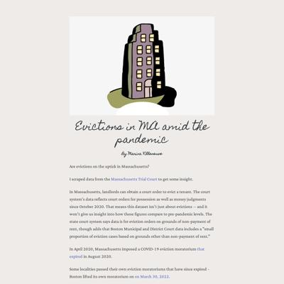](screenshots/marinav13.github.io/My2ndProject_index.html-wide-full.jpg)|
|[MA Pandemic Job Loss](https://marinav13.github.io/MyProject/) :x: og:title :x: og:description :x: og:image [how to fix](https://jonathansoma.com/everything/web/social-tags/)||||

### Automatic Checks

**https://marinav13.github.io/My2ndProject/**

* Image(s) need `alt` tags, [info here](https://abilitynet.org.uk/news-blogs/five-golden-rules-compliant-alt-text) and [tips here](https://twitter.com/FrankElavsky/status/1469023374529765385)
    * Image `building.jpg` missing `alt` tag
    * Image `FR.png` missing `alt` tag
    * Image `MA.png` missing `alt` tag
* Change URL to be all in lowercase
* Has sideways scrollbars in mobile version – check padding, margins, image widths

**https://marinav13.github.io/MyProject/**

* Image(s) need `alt` tags, [info here](https://abilitynet.org.uk/news-blogs/five-golden-rules-compliant-alt-text) and [tips here](https://twitter.com/FrankElavsky/status/1469023374529765385)
    * Image `mass1.png` missing `alt` tag
* Change URL to be all in lowercase

## medievalmadeline.github.io

|url|mobile|medium|wide|
|---|---|---|---|
|[Madeline's Cardamom Website](https://medievalmadeline.github.io/cardamom/) :x: og:title :x: og:description :x: og:image [how to fix](https://jonathansoma.com/everything/web/social-tags/)||||
|[Site not found · GitHub Pages](https://medievalmadeline.github.io/Website/) :x: og:title :x: og:description :x: og:image [how to fix](https://jonathansoma.com/everything/web/social-tags/)|request failed|request failed|request failed|

### Automatic Checks

**https://medievalmadeline.github.io/cardamom/**

* Missing viewport meta tag in `<head>`, needed to tell browser it's responsive. Add `<meta name="viewport" content="width=device-width, initial-scale=1, shrink-to-fit=no">`

**https://medievalmadeline.github.io/Website/**

* **Could not access the page** - if you moved it, let me know!
* Change URL to be all in lowercase
* Missing viewport meta tag in `<head>`, needed to tell browser it's responsive. Add `<meta name="viewport" content="width=device-width, initial-scale=1, shrink-to-fit=no">`
* Has sideways scrollbars in mobile version – check padding, margins, image widths

## meganmkim.github.io

|url|mobile|medium|wide|
|---|---|---|---|
|[Digital Local News Organizations Financed by Philanthropy](https://meganmkim.github.io/digital_local_news/) :x: og:image [how to fix](https://jonathansoma.com/everything/web/social-tags/)||||
|[Record High Book Ban in 2021-2022 Driven by Four States](https://meganmkim.github.io/usbannedbooks/) :x: og:title :x: og:description :x: og:image [how to fix](https://jonathansoma.com/everything/web/social-tags/)||||

### Automatic Checks

**https://meganmkim.github.io/digital_local_news/**

* Add a link to your project's GitHub repo, so people can review your code
* Image(s) need `alt` tags, [info here](https://abilitynet.org.uk/news-blogs/five-golden-rules-compliant-alt-text) and [tips here](https://twitter.com/FrankElavsky/status/1469023374529765385)
    * Image `header_image.jpg` missing `alt` tag
    * Image `yr_revenue.svg` missing `alt` tag
    * Image `revenue.svg` missing `alt` tag
    * Image `revenue_distribution.svg` missing `alt` tag
* Change URL to use `-` instead of spaces or underscores

**https://meganmkim.github.io/usbannedbooks/**

* Datawrapper chart missing description, fill out *Alternative description for screen readers* section on Annotate tab, [tips here](https://twitter.com/FrankElavsky/status/1469023374529765385)

## mfhan.github.io

|url|mobile|medium|wide|
|---|---|---|---|
|[Queens and Crowns: The Royal Consort Conundrum](https://mfhan.github.io/project1/)|[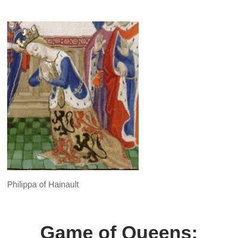](screenshots/mfhan.github.io/project1_index.html-mobile-full.jpg)|||
|[Gulf Countries' Sports Shopping Spree](https://mfhan.github.io/sportsbuy/) :x: og:title :x: og:description :x: og:image [how to fix](https://jonathansoma.com/everything/web/social-tags/)||[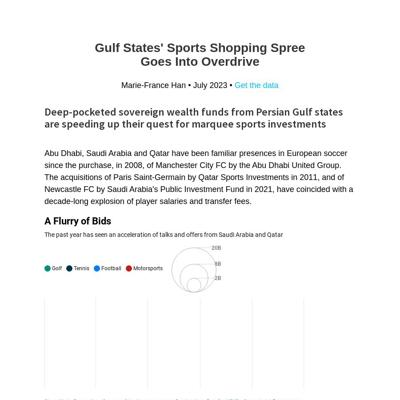](screenshots/mfhan.github.io/sportsbuy_index.html-medium-full.jpg)|[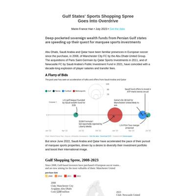](screenshots/mfhan.github.io/sportsbuy_index.html-wide-full.jpg)|

### Automatic Checks

**https://mfhan.github.io/project1/**

No issues found! 🎉

**https://mfhan.github.io/sportsbuy/**

No issues found! 🎉

## mizuhomorioka.github.io

|url|mobile|medium|wide|
|---|---|---|---|
|[Mizuho Morioka's Website](https://mizuhomorioka.github.io/first_project/) :x: og:title :x: og:description :x: og:image [how to fix](https://jonathansoma.com/everything/web/social-tags/)|[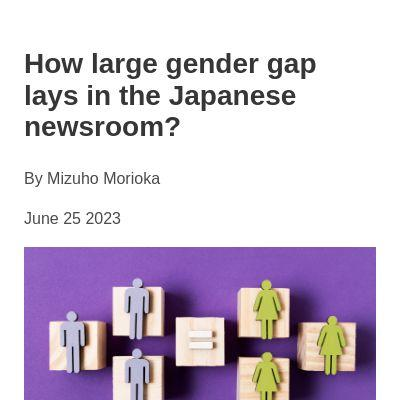](screenshots/mizuhomorioka.github.io/first_project_index.html-mobile-full.jpg)|||
|[Mizuho Morioka's Website](https://mizuhomorioka.github.io/vessel/) :x: og:title :x: og:description :x: og:image [how to fix](https://jonathansoma.com/everything/web/social-tags/)||||

### Automatic Checks

**https://mizuhomorioka.github.io/first_project/**

* Image(s) need `alt` tags, [info here](https://abilitynet.org.uk/news-blogs/five-golden-rules-compliant-alt-text) and [tips here](https://twitter.com/FrankElavsky/status/1469023374529765385)
    * Image `equality.jpg` missing `alt` tag
* Change URL to use `-` instead of spaces or underscores

**https://mizuhomorioka.github.io/vessel/**

* Minimum font size should be 12px, enlarge text in Illustrator
    * Text `Japan` is too small at 7px
    * Text `Kuwait` is too small at 5px
    * Text `China` is too small at 8px
    * Text `Saudi Arabia` is too small at 7px
    * Text `Qatar` is too small at 5px
    * Text `Taiwan` is too small at 7px
    * Text `UAE` is too small at 5px
    * *and 14 more*

## mollylongman.github.io

|url|mobile|medium|wide|
|---|---|---|---|
|[Molly Longman's Incredible Website For Her First Lede Project](https://mollylongman.github.io/barbie-careers/) :x: og:title :x: og:description :x: og:image [how to fix](https://jonathansoma.com/everything/web/social-tags/)|||[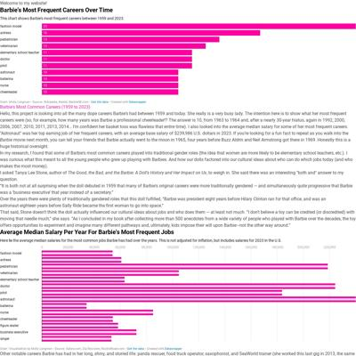](screenshots/mollylongman.github.io/barbie-careers_index.html-wide-full.jpg)|
|[free-lunch/index.html](https://mollylongman.github.io/free-lunch/) :x: og:title :x: og:description :x: og:image [how to fix](https://jonathansoma.com/everything/web/social-tags/)|||[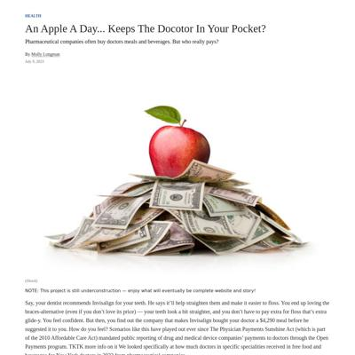](screenshots/mollylongman.github.io/free-lunch_index.html-wide-full.jpg)|

### Automatic Checks

**https://mollylongman.github.io/barbie-careers/**

* Add a link to your project's GitHub repo, so people can review your code
* Missing viewport meta tag in `<head>`, needed to tell browser it's responsive. Add `<meta name="viewport" content="width=device-width, initial-scale=1, shrink-to-fit=no">`

**https://mollylongman.github.io/free-lunch/**

* Needs a title, add a `<title>` tag to the `<head>`
* Missing viewport meta tag in `<head>`, needed to tell browser it's responsive. Add `<meta name="viewport" content="width=device-width, initial-scale=1, shrink-to-fit=no">`

## muimran.github.io

|url|mobile|medium|wide|
|---|---|---|---|
|[spices](https://muimran.github.io/) :x: og:title :x: og:description :x: og:image [how to fix](https://jonathansoma.com/everything/web/social-tags/)|||[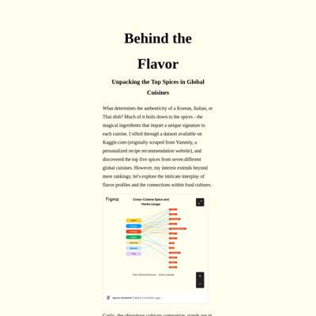](screenshots/muimran.github.io/index.html-wide-full.jpg)|
|[Page not found · GitHub Pages](https://muimran.github.io/lede_project_2) :x: og:title :x: og:description :x: og:image [how to fix](https://jonathansoma.com/everything/web/social-tags/)|request failed|request failed|request failed|

### Automatic Checks

**https://muimran.github.io/**

No issues found! 🎉

**https://muimran.github.io/lede_project_2**

* **Could not access the page** - if you moved it, let me know!
* Change URL to use `-` instead of spaces or underscores
* Missing viewport meta tag in `<head>`, needed to tell browser it's responsive. Add `<meta name="viewport" content="width=device-width, initial-scale=1, shrink-to-fit=no">`
* Has sideways scrollbars in mobile version – check padding, margins, image widths

## mymo5303.github.io

|url|mobile|medium|wide|
|---|---|---|---|
|[Children in Japan are taking their own lives](https://mymo5303.github.io/project01-suicide/)||||
|["Morioka: Hidden Gem Chosen by the New York Times"](https://mymo5303.github.io/project02-destinationmorioka/)|||[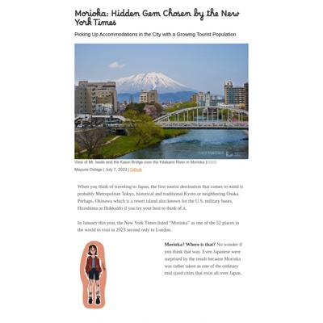](screenshots/mymo5303.github.io/project02-destinationmorioka_index.html-wide-full.jpg)|

### Automatic Checks

**https://mymo5303.github.io/project01-suicide/**

No issues found! 🎉

**https://mymo5303.github.io/project02-destinationmorioka/**

* Has sideways scrollbars in mobile version – check padding, margins, image widths

## nam-sgn327.github.io

|url|mobile|medium|wide|
|---|---|---|---|
|[Fanfiction.net's decline](https://nam-sgn327.github.io/fanfiction/)||||
|[Weightlifting on the 'gram](https://nam-sgn327.github.io/weightlifters/)||||

### Automatic Checks

**https://nam-sgn327.github.io/fanfiction/**

No issues found! 🎉

**https://nam-sgn327.github.io/weightlifters/**

No issues found! 🎉

## namu-sampath.github.io

|url|mobile|medium|wide|
|---|---|---|---|
|[project-01/index.html](https://namu-sampath.github.io/project-01) :x: og:title :x: og:description :x: og:image [how to fix](https://jonathansoma.com/everything/web/social-tags/)||||
|[Unmasked: The Unveiling of Serial Killers](https://namu-sampath.github.io/unmasked/) :x: og:title :x: og:description :x: og:image [how to fix](https://jonathansoma.com/everything/web/social-tags/)||||

### Automatic Checks

**https://namu-sampath.github.io/project-01**

* Needs a title, add a `<title>` tag to the `<head>`
* Add a link to your project's GitHub repo, so people can review your code
* Missing viewport meta tag in `<head>`, needed to tell browser it's responsive. Add `<meta name="viewport" content="width=device-width, initial-scale=1, shrink-to-fit=no">`
* Has sideways scrollbars in mobile version – check padding, margins, image widths

**https://namu-sampath.github.io/unmasked/**

No issues found! 🎉

## nguyenkim.ca

|url|mobile|medium|wide|
|---|---|---|---|
|[Class, Sensibilities, and the Gilmore Girls Literary Canon](https://nguyenkim.ca/data-viz/gilmores) :x: og:title :x: og:description :x: og:image [how to fix](https://jonathansoma.com/everything/web/social-tags/)||||
|[Westminster's Top Dogs](https://nguyenkim.ca/data-viz/westminster) :x: og:title :x: og:description :x: og:image [how to fix](https://jonathansoma.com/everything/web/social-tags/)||||

### Automatic Checks

**https://nguyenkim.ca/data-viz/gilmores**

No issues found! 🎉

**https://nguyenkim.ca/data-viz/westminster**

No issues found! 🎉

## niallsimonian.github.io

|url|mobile|medium|wide|
|---|---|---|---|
|[Project 2: <a href="https://www.w3schools.com">here</a>](https://niallsimonian.github.io/Project-01/) :x: og:title :x: og:description :x: og:image [how to fix](https://jonathansoma.com/everything/web/social-tags/)||||
|[Fox News Cable Ratings](https://niallsimonian.github.io/project-02/) :x: og:title :x: og:description :x: og:image [how to fix](https://jonathansoma.com/everything/web/social-tags/)||||

### Automatic Checks

**https://niallsimonian.github.io/Project-01/**

* Change URL to be all in lowercase
* Missing viewport meta tag in `<head>`, needed to tell browser it's responsive. Add `<meta name="viewport" content="width=device-width, initial-scale=1, shrink-to-fit=no">`
* Has sideways scrollbars in mobile version – check padding, margins, image widths

**https://niallsimonian.github.io/project-02/**

* Has sideways scrollbars in mobile version – check padding, margins, image widths
* Minimum font size should be 12px, enlarge text in Illustrator
    * Text `3,000,000 ` is too small at 9px
    * Text `viewers` is too small at 9px
    * Text `2,600,000` is too small at 9px
    * Text `2,200,000` is too small at 9px
    * Text `1,800,000` is too small at 9px
    * Text `1,400,000` is too small at 9px
    * Text `1,000,000` is too small at 9px
    * *and 174 more*
* Overlapping elements in ai2html, check [the overflow video](https://www.youtube.com/watch?v=6vHsnjTp3_w) or make a smaller size
   * Text `6/26` overlaps with `June 28` at screen width 400
* Missing font(s), you might need web fonts – [text explanation](https://gist.github.com/jsoma/631621e0807b26d49f5aef5260f79162), [video explanation](https://www.youtube.com/watch?v=HNhIeb_jEYM&list=PLewNEVDy7gq3MSrrO3eMEW8PhGMEVh2X2&index=3)
    * `Superclarendon` font not found, used in 147 text objects. Example: _Trump pleads not guilty to documents case in Florida, "The Five" : June 13, 2,984,000_

## prachivashishtt.github.io

|url|mobile|medium|wide|
|---|---|---|---|
|[Government Requests From Meta on a Rise](https://prachivashishtt.github.io/Vashisht_Meta_Lede/) :x: og:title :x: og:description :x: og:image [how to fix](https://jonathansoma.com/everything/web/social-tags/)|||[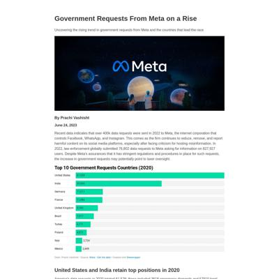](screenshots/prachivashishtt.github.io/Vashisht_Meta_Lede_index.html-wide-full.jpg)|
|[Government Requests From Meta on a Rise](https://prachivashishtt.github.io/violence_against_women/) :x: og:title :x: og:description :x: og:image [how to fix](https://jonathansoma.com/everything/web/social-tags/)||||

### Automatic Checks

**https://prachivashishtt.github.io/Vashisht_Meta_Lede/**

* Change URL to use `-` instead of spaces or underscores
* Change URL to be all in lowercase

**https://prachivashishtt.github.io/violence_against_women/**

* Change URL to use `-` instead of spaces or underscores

## rajitsengupta.github.io

|url|mobile|medium|wide|
|---|---|---|---|
|[Rajit Sengupta's Project](https://rajitsengupta.github.io/browsing_history_project/) :x: og:title :x: og:description :x: og:image [how to fix](https://jonathansoma.com/everything/web/social-tags/)||||
|[This is your title](https://rajitsengupta.github.io/extreme_weather_events_India_2023/) :x: og:title :x: og:description :x: og:image [how to fix](https://jonathansoma.com/everything/web/social-tags/)||[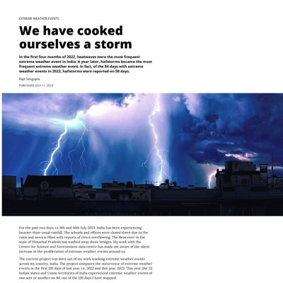](screenshots/rajitsengupta.github.io/extreme_weather_events_India_2023_index.html-medium-full.jpg)||

### Automatic Checks

**https://rajitsengupta.github.io/browsing_history_project/**

* Add a link to your project's GitHub repo, so people can review your code
* Datawrapper chart missing description, fill out *Alternative description for screen readers* section on Annotate tab, [tips here](https://twitter.com/FrankElavsky/status/1469023374529765385)
* Datawrapper chart missing description, fill out *Alternative description for screen readers* section on Annotate tab, [tips here](https://twitter.com/FrankElavsky/status/1469023374529765385)
* Change URL to use `-` instead of spaces or underscores
* Has sideways scrollbars in mobile version – check padding, margins, image widths

**https://rajitsengupta.github.io/extreme_weather_events_India_2023/**

* Add a link to your project's GitHub repo, so people can review your code
* Datawrapper chart missing description, fill out *Alternative description for screen readers* section on Annotate tab, [tips here](https://twitter.com/FrankElavsky/status/1469023374529765385)
* Change URL to use `-` instead of spaces or underscores
* Change URL to be all in lowercase
* Has sideways scrollbars in mobile version – check padding, margins, image widths
* Minimum font size should be 12px, enlarge text in Illustrator
    * Text `Region` is too small at 10px
    * Text `Central` is too small at 10px
    * Text `Maharashtra` is too small at 10px
    * Text `1 day` is too small at 8px
    * Text `15 days` is too small at 8px
    * Text `31 days` is too small at 8px
    * Text `East and` is too small at 10px
    * *and 489 more*
* Overlapping elements in ai2html, check [the overflow video](https://www.youtube.com/watch?v=6vHsnjTp3_w) or make a smaller size
   * Text `Chhattisgarh` overlaps with `Gujarat` at screen width 400
   * Text `Gujarat` overlaps with `Goa` at screen width 400
   * Text `Maha` overlaps with `MP` at screen width 400
   * Text `MP` overlaps with `23` at screen width 400
   * Text `Northeastern states` overlaps with `Jharkhand` at screen width 400
   * Text `25` overlaps with `Bihar` at screen width 400
   * Text `10` overlaps with `11` at screen width 400
   * *and 63 more*

## reliablerascal.github.io

|url|mobile|medium|wide|
|---|---|---|---|
|[Who's Still Riding CTA Trains?](https://reliablerascal.github.io/cta_ridership/) :x: og:title :x: og:description :x: og:image [how to fix](https://jonathansoma.com/everything/web/social-tags/)||||
|[Still Shouting Above the Din of Our Rice Krispies: The Staying Power of Synchronicity](https://reliablerascal.github.io/synchronicity/) :x: og:title :x: og:description :x: og:image [how to fix](https://jonathansoma.com/everything/web/social-tags/)||||

### Automatic Checks

**https://reliablerascal.github.io/cta_ridership/**

* Change URL to use `-` instead of spaces or underscores
* Missing viewport meta tag in `<head>`, needed to tell browser it's responsive. Add `<meta name="viewport" content="width=device-width, initial-scale=1, shrink-to-fit=no">`

**https://reliablerascal.github.io/synchronicity/**

* Image(s) need `alt` tags, [info here](https://abilitynet.org.uk/news-blogs/five-golden-rules-compliant-alt-text) and [tips here](https://twitter.com/FrankElavsky/status/1469023374529765385)
    * Image `images/4flames_960px.png` missing `alt` tag
* Missing viewport meta tag in `<head>`, needed to tell browser it's responsive. Add `<meta name="viewport" content="width=device-width, initial-scale=1, shrink-to-fit=no">`

## retrospatial.github.io

|url|mobile|medium|wide|
|---|---|---|---|
|[Buffy Podcasts](https://retrospatial.github.io/buffy-podcasts/) :x: og:title :x: og:description :x: og:image [how to fix](https://jonathansoma.com/everything/web/social-tags/)||||
|[Tumblr Fandometrics](https://retrospatial.github.io/tumblr-fandometrics/) :x: og:title :x: og:description :x: og:image [how to fix](https://jonathansoma.com/everything/web/social-tags/)|||[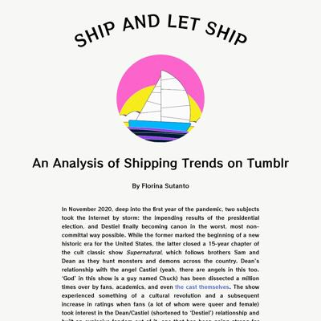](screenshots/retrospatial.github.io/tumblr-fandometrics_index.html-wide-full.jpg)|

### Automatic Checks

**https://retrospatial.github.io/buffy-podcasts/**

* Has sideways scrollbars in mobile version – check padding, margins, image widths

**https://retrospatial.github.io/tumblr-fandometrics/**

* Image(s) need `alt` tags, [info here](https://abilitynet.org.uk/news-blogs/five-golden-rules-compliant-alt-text) and [tips here](https://twitter.com/FrankElavsky/status/1469023374529765385)
    * Image `./images/header.svg` missing `alt` tag
    * Image `./images/tumblr gif crop.gif` missing `alt` tag

## scatterplotsandtea.github.io

|url|mobile|medium|wide|
|---|---|---|---|
|[Elizabeth Connor's Portfolio](https://scatterplotsandtea.github.io/portfolio-website/) :x: og:title :x: og:description :x: og:image [how to fix](https://jonathansoma.com/everything/web/social-tags/)||||
|[Scraping the National UFO Reporting Center](https://scatterplotsandtea.github.io/UFOs/) :x: og:title :x: og:description :x: og:image [how to fix](https://jonathansoma.com/everything/web/social-tags/)||||

### Automatic Checks

**https://scatterplotsandtea.github.io/portfolio-website/**

* Add a link to your project's GitHub repo, so people can review your code

**https://scatterplotsandtea.github.io/UFOs/**

* Change URL to be all in lowercase

## seulgijung.github.io

|url|mobile|medium|wide|
|---|---|---|---|
|[Seulgi Jung's project 01](https://seulgijung.github.io/project01/) :x: og:title :x: og:description :x: og:image [how to fix](https://jonathansoma.com/everything/web/social-tags/)|||[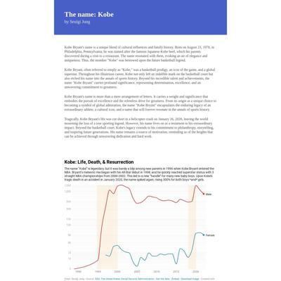](screenshots/seulgijung.github.io/project01_index.html-wide-full.jpg)|
|[SVG with D3](https://seulgijung.github.io/project2/) :x: og:title :x: og:description :x: og:image [how to fix](https://jonathansoma.com/everything/web/social-tags/)||||

### Automatic Checks

**https://seulgijung.github.io/project01/**

* Add a link to your project's GitHub repo, so people can review your code
* Missing viewport meta tag in `<head>`, needed to tell browser it's responsive. Add `<meta name="viewport" content="width=device-width, initial-scale=1, shrink-to-fit=no">`

**https://seulgijung.github.io/project2/**

* Add a link to your project's GitHub repo, so people can review your code

## sho-miyasaka.github.io

|url|mobile|medium|wide|
|---|---|---|---|
|[More Japanese Feel a Renewed Affinity for South Korea](https://sho-miyasaka.github.io/project-01/) :x: og:title :x: og:description :x: og:image [how to fix](https://jonathansoma.com/everything/web/social-tags/)||||
|[Weak Voice of the Younger Generation in Japanese Politics](https://sho-miyasaka.github.io/project-02/) :x: og:title :x: og:description :x: og:image [how to fix](https://jonathansoma.com/everything/web/social-tags/)||||

### Automatic Checks

**https://sho-miyasaka.github.io/project-01/**

No issues found! 🎉

**https://sho-miyasaka.github.io/project-02/**

* Has sideways scrollbars in mobile version – check padding, margins, image widths

## sinderskir.github.io

|url|mobile|medium|wide|
|---|---|---|---|
|[city-in-red/index.html](https://sinderskir.github.io/city-in-red/) :x: og:title :x: og:description :x: og:image [how to fix](https://jonathansoma.com/everything/web/social-tags/)||||
|[How did Brazilian Politicians Approach January 8th on Twitter?](https://sinderskir.github.io/project1_jan8/) :x: og:title :x: og:description :x: og:image [how to fix](https://jonathansoma.com/everything/web/social-tags/)||||

### Automatic Checks

**https://sinderskir.github.io/city-in-red/**

* Needs a title, add a `<title>` tag to the `<head>`
* Image(s) need `alt` tags, [info here](https://abilitynet.org.uk/news-blogs/five-golden-rules-compliant-alt-text) and [tips here](https://twitter.com/FrankElavsky/status/1469023374529765385)
    * Image `https://github.com/sinderskir/city-in-red/blob/main/img/rapes_historical-01.png?raw=true` missing `alt` tag
    * Image `https://github.com/sinderskir/city-in-red/blob/main/img/chart_rapesweekday-01.png?raw=true` missing `alt` tag
    * Image `https://github.com/sinderskir/city-in-red/blob/main/img/rapes_mean_Prancheta%201.png?raw=true` missing `alt` tag

**https://sinderskir.github.io/project1_jan8/**

* Add a link to your project's GitHub repo, so people can review your code
* Change URL to use `-` instead of spaces or underscores
* Has sideways scrollbars in mobile version – check padding, margins, image widths

## tejalwakchoure.github.io

|url|mobile|medium|wide|
|---|---|---|---|
|[So you think you can Broadway?](https://tejalwakchoure.github.io/broadway)||||
|[Global iodine levels set to reach record high by 2050, threaten ozone layer](https://tejalwakchoure.github.io/iodine-ozone/)||||

### Automatic Checks

**https://tejalwakchoure.github.io/broadway**

No issues found! 🎉

**https://tejalwakchoure.github.io/iodine-ozone/**

No issues found! 🎉

## unoptimal.github.io

|url|mobile|medium|wide|
|---|---|---|---|
|[Magnus Carlsen's Chess Journey](https://unoptimal.github.io/magnus-journey/) :x: og:title :x: og:description :x: og:image [how to fix](https://jonathansoma.com/everything/web/social-tags/)||||

### Automatic Checks

**https://unoptimal.github.io/magnus-journey/**

* Has sideways scrollbars in mobile version – check padding, margins, image widths

## winter-beard.github.io

|url|mobile|medium|wide|
|---|---|---|---|
|[Unplanned](https://winter-beard.github.io/) :x: og:title :x: og:description :x: og:image [how to fix](https://jonathansoma.com/everything/web/social-tags/)||||
|[Conservative Jobs](https://winter-beard.github.io/RedBalloon/) :x: og:title :x: og:description :x: og:image [how to fix](https://jonathansoma.com/everything/web/social-tags/)||||

### Automatic Checks

**https://winter-beard.github.io/**

No issues found! 🎉

**https://winter-beard.github.io/RedBalloon/**

* Change URL to be all in lowercase

## yikemats.github.io

|url|mobile|medium|wide|
|---|---|---|---|
|[NYC Pays Forward to Immigrants](https://yikemats.github.io/asylum-seekers/) :x: og:title :x: og:description :x: og:image [how to fix](https://jonathansoma.com/everything/web/social-tags/)|[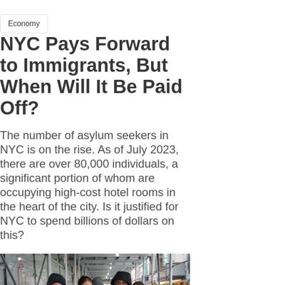](screenshots/yikemats.github.io/asylum-seekers_index.html-mobile-full.jpg)|||
|[Is Elon Musk Devil or Angel?](https://yikemats.github.io/project1/) :x: og:title :x: og:description :x: og:image [how to fix](https://jonathansoma.com/everything/web/social-tags/)||||

### Automatic Checks

**https://yikemats.github.io/asylum-seekers/**

* Has sideways scrollbars in mobile version – check padding, margins, image widths

**https://yikemats.github.io/project1/**

* Image(s) need `alt` tags, [info here](https://abilitynet.org.uk/news-blogs/five-golden-rules-compliant-alt-text) and [tips here](https://twitter.com/FrankElavsky/status/1469023374529765385)
    * Image `ElonJet.jpg` missing `alt` tag

