# Lede Program 2023 Personal Projects Test Page

Quick checks to make sure our pages are looking their best.

<table><tr><td><a href="#aishyvgithubio"> aishyv.github.io</a></td>
<td><a href="#colvapgithubio"> colvap.github.io</a></td>
<td><a href="#ann2128githubio"> ann2128.github.io</a></td>
<td><a href="#alliekrugmangithubio"> alliekrugman.github.io</a></td>
</tr><tr>
<td><a href="#anaeazpuruagithubio"> anaeazpurua.github.io</a></td>
<td><a href="#githubcom"> github.com</a></td>
<td><a href="#bennett-gpjgithubio"> bennett-gpj.github.io</a></td>
<td><a href="#retrospatialgithubio"> retrospatial.github.io</a></td>
</tr><tr>
<td><a href="#coralmurphy3githubio"> coralmurphy3.github.io</a></td>
<td><a href="#cristinadelmargithubio"> cristinadelmar.github.io</a></td>
<td><a href="#davidmhorowitzgithubio"> davidmhorowitz.github.io</a></td>
<td><a href="#scatterplotsandteagithubio"> scatterplotsandtea.github.io</a></td>
</tr><tr>
<td><a href="#eculliford1githubio">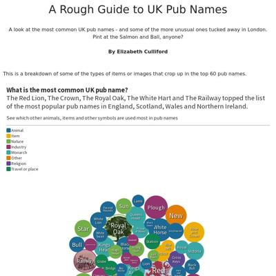 eculliford1.github.io</a></td>
<td><a href="#efkodongithubio">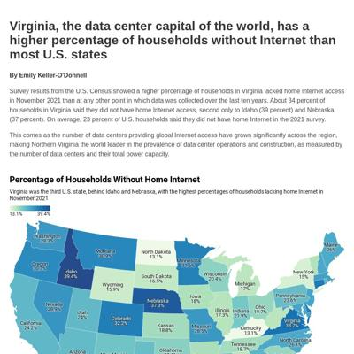 efkodon.github.io</a></td>
<td><a href="#hannaakanggithubio">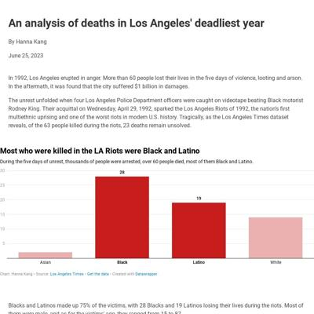 hannaakang.github.io</a></td>
<td><a href="#federicodtgithubio"> federicodt.github.io</a></td>
</tr><tr>
<td><a href="#gavaglianogithubio"> gavagliano.github.io</a></td>
<td>juditecypreste.com request failed</td>
<td><a href="#idontknowhowcomputersworkgithubio"> idontknowhowcomputerswork.github.io</a></td>
<td><a href="#winter-beardgithubio">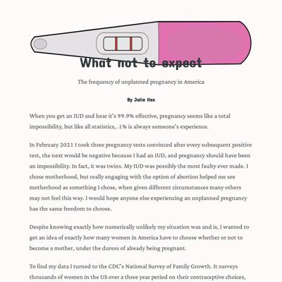 winter-beard.github.io</a></td>
</tr><tr>
<td><a href="#unoptimalgithubio">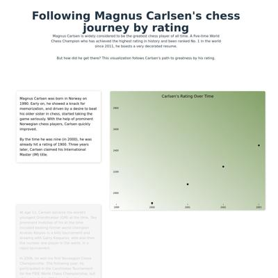 unoptimal.github.io</a></td>
<td><a href="#githubcom">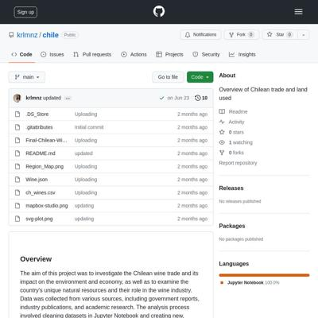 github.com</a></td>
<td><a href="#nguyenkimca"> nguyenkim.ca</a></td>
<td><a href="#krystalwongithubio"> krystalwon.github.io</a></td>
</tr><tr>
<td>lei10003.github.io request failed</td>
<td>medievalmadeline.github.io request failed</td>
<td><a href="#marinav13githubio"> marinav13.github.io</a></td>
<td>marcodallastella.github.io request failed</td>
</tr><tr>
<td><a href="#margauxwritesgithubio"> margauxwrites.github.io</a></td>
<td><a href="#mfhangithubio"> mfhan.github.io</a></td>
<td>mymo5303.github.io request failed</td>
<td><a href="#meganmkimgithubio"> meganmkim.github.io</a></td>
</tr><tr>
<td><a href="#mizuhomoriokagithubio"> mizuhomorioka.github.io</a></td>
<td><a href="#mollylongmangithubio">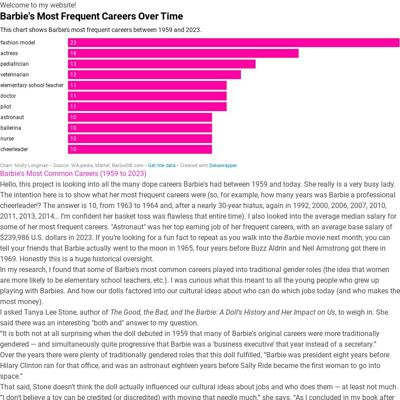 mollylongman.github.io</a></td>
<td><a href="#muimrangithubio">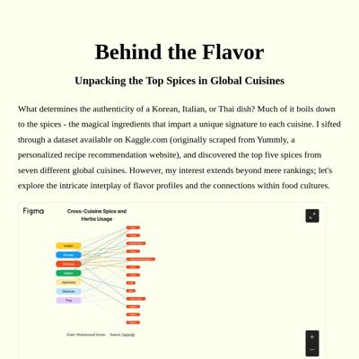 muimran.github.io</a></td>
<td><a href="#nam-sgn327githubio"> nam-sgn327.github.io</a></td>
</tr><tr>
<td><a href="#namu-sampathgithubio"> namu-sampath.github.io</a></td>
<td><a href="#niallsimoniangithubio"> niallsimonian.github.io</a></td>
<td><a href="#githubcom">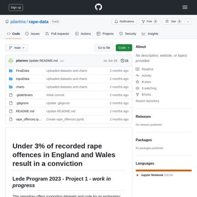 github.com</a></td>
<td><a href="#prachivashishttgithubio"> prachivashishtt.github.io</a></td>
</tr><tr>
<td><a href="#sinderskirgithubio"> sinderskir.github.io</a></td>
<td><a href="#rajitsenguptagithubio"> rajitsengupta.github.io</a></td>
<td><a href="#reliablerascalgithubio">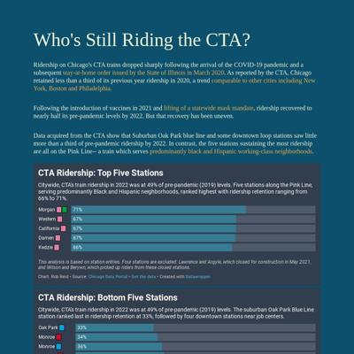 reliablerascal.github.io</a></td>
<td><a href="#celyvelezgithubio"> celyvelez.github.io</a></td>
</tr><tr>
<td><a href="#seulgijunggithubio"> seulgijung.github.io</a></td>
<td><a href="#sho-miyasakagithubio"> sho-miyasaka.github.io</a></td>
<td><a href="#jellomoatgithubio"> jellomoat.github.io</a></td>
<td><a href="#tejalwakchouregithubio"> tejalwakchoure.github.io</a></td>
</tr><tr>
<td><a href="#yikematsgithubio">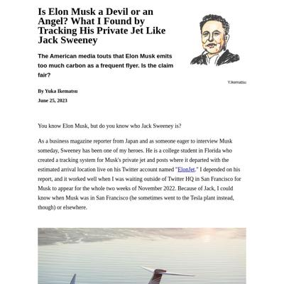 yikemats.github.io</a></td>
<td><a href="#karinashedgithubio"> karinashed.github.io</a></td>
<td><a href="#bique2002githubio"> bique2002.github.io</a></td>
</tr></table>

## aishyv.github.io

|url|mobile|medium|wide|
|---|---|---|---|
|[Credit where it’s due, unless you’re a singer](https://aishyv.github.io/missing-singers/) :x: og:title :x: og:description :x: og:image [how to fix](https://jonathansoma.com/everything/web/social-tags/)||||

### Automatic Checks

**https://aishyv.github.io/missing-singers/**

* Image(s) need `alt` tags, [info here](https://abilitynet.org.uk/news-blogs/five-golden-rules-compliant-alt-text) and [tips here](https://twitter.com/FrankElavsky/status/1469023374529765385)
    * Image `image2.png` missing `alt` tag
    * Image `image.png` missing `alt` tag

## colvap.github.io

|url|mobile|medium|wide|
|---|---|---|---|
|[How Bad Could It Be?](https://colvap.github.io/Lede-Program-2023---Air-Pollution-New-York-vs-China/) :x: og:title :x: og:description :x: og:image [how to fix](https://jonathansoma.com/everything/web/social-tags/)||||

### Automatic Checks

**https://colvap.github.io/Lede-Program-2023---Air-Pollution-New-York-vs-China/**

* Image(s) need `alt` tags, [info here](https://abilitynet.org.uk/news-blogs/five-golden-rules-compliant-alt-text) and [tips here](https://twitter.com/FrankElavsky/status/1469023374529765385)
    * Image `smog2.jpeg` missing `alt` tag
* Change URL to be all in lowercase
* Has sideways scrollbars in mobile version – check padding, margins, image widths

## ann2128.github.io

|url|mobile|medium|wide|
|---|---|---|---|
|[Mapping Community Gardens](https://ann2128.github.io/nyc_community_gardens) :x: og:title :x: og:description :x: og:image [how to fix](https://jonathansoma.com/everything/web/social-tags/)||||

### Automatic Checks

**https://ann2128.github.io/nyc_community_gardens**

* Change URL to use `-` instead of spaces or underscores
* Has sideways scrollbars in mobile version – check padding, margins, image widths

## alliekrugman.github.io

|url|mobile|medium|wide|
|---|---|---|---|
|[Organ donation needs a bigger heart](https://alliekrugman.github.io/left-my-heart/) :x: og:title :x: og:description :x: og:image [how to fix](https://jonathansoma.com/everything/web/social-tags/)||||

### Automatic Checks

**https://alliekrugman.github.io/left-my-heart/**

No issues found! 🎉

## anaeazpurua.github.io

|url|mobile|medium|wide|
|---|---|---|---|
|[Banking on Nostalgia](https://anaeazpurua.github.io/project_one/) :x: og:title :x: og:description :x: og:image [how to fix](https://jonathansoma.com/everything/web/social-tags/)||||

### Automatic Checks

**https://anaeazpurua.github.io/project_one/**

* Change URL to use `-` instead of spaces or underscores
* Minimum font size should be 12px, enlarge text in Illustrator
    * Text `Visit with my parents` is too small at 10px
    * Text `Visit with my kids` is too small at 10px
    * Text `1993` is too small at 10px
    * Text `2023` is too small at 10px
    * Text `New ` is too small at 10px
    * Text `attractions` is too small at 10px
    * Text `Magic Kingdom ` is too small at 10px
    * *and 95 more*
* Overlapping elements in ai2html, check [the overflow video](https://www.youtube.com/watch?v=6vHsnjTp3_w) or make a smaller size
   * Text `1970` overlaps with `1975` at screen width 400
   * Text `1975` overlaps with `1980` at screen width 400
   * Text `1980` overlaps with `1985` at screen width 400
   * Text `1985` overlaps with `1990` at screen width 400
   * Text `1990` overlaps with `1995` at screen width 400
   * Text `1995` overlaps with `2000` at screen width 400
   * Text `2000` overlaps with `2005` at screen width 400
   * *and 30 more*

## github.com

|url|mobile|medium|wide|
|---|---|---|---|
|[GitHub - bennett-gpj/Artisanal-mining-in-DRC: An exploration of the data from informal mining sites in Democratic Republic of Congo (2020–2023)](https://github.com/bennett-gpj/Artisanal-mining-in-DRC/tree/main)|[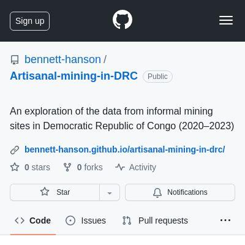](screenshots/github.com/bennett-gpj_Artisanal-mining-in-DRC_tree_main_index.html-mobile-full.jpg)|||

### Automatic Checks

**https://github.com/bennett-gpj/Artisanal-mining-in-DRC/tree/main**

* Change URL to be all in lowercase

## bennett-gpj.github.io

|url|mobile|medium|wide|
|---|---|---|---|
|[Gangs-and-Displacement-in-Haiti](https://bennett-gpj.github.io/Gangs-and-Displacement-in-Haiti/) :x: og:title :x: og:description :x: og:image [how to fix](https://jonathansoma.com/everything/web/social-tags/)|||[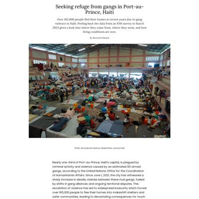](screenshots/bennett-gpj.github.io/Gangs-and-Displacement-in-Haiti_index.html-wide-full.jpg)|

### Automatic Checks

**https://bennett-gpj.github.io/Gangs-and-Displacement-in-Haiti/**

* Change URL to be all in lowercase
* Has sideways scrollbars in mobile version – check padding, margins, image widths

## retrospatial.github.io

|url|mobile|medium|wide|
|---|---|---|---|
|[Buffy Podcasts](https://retrospatial.github.io/buffy-podcasts/) :x: og:title :x: og:description :x: og:image [how to fix](https://jonathansoma.com/everything/web/social-tags/)||||

### Automatic Checks

**https://retrospatial.github.io/buffy-podcasts/**

* Has sideways scrollbars in mobile version – check padding, margins, image widths

## coralmurphy3.github.io

|url|mobile|medium|wide|
|---|---|---|---|
|[Project 1](https://coralmurphy3.github.io/Project-1) :x: og:title :x: og:description :x: og:image [how to fix](https://jonathansoma.com/everything/web/social-tags/)||||

### Automatic Checks

**https://coralmurphy3.github.io/Project-1**

* Add a link to your project's GitHub repo, so people can review your code
* Change URL to be all in lowercase
* Has sideways scrollbars in mobile version – check padding, margins, image widths

## cristinadelmar.github.io

|url|mobile|medium|wide|
|---|---|---|---|
|[No Park to Go](https://cristinadelmar.github.io/parks-recovery-puerto-rico/) :x: og:title :x: og:description :x: og:image [how to fix](https://jonathansoma.com/everything/web/social-tags/)|||[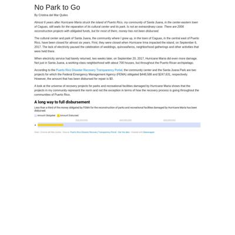](screenshots/cristinadelmar.github.io/parks-recovery-puerto-rico_index.html-wide-full.jpg)|

### Automatic Checks

**https://cristinadelmar.github.io/parks-recovery-puerto-rico/**

No issues found! 🎉

## davidmhorowitz.github.io

|url|mobile|medium|wide|
|---|---|---|---|
|[New community college teachers in the East Bay pay nearly half of their income to rent where they teach](https://davidmhorowitz.github.io/HTML-youtube-folder/) :x: og:title :x: og:description :x: og:image [how to fix](https://jonathansoma.com/everything/web/social-tags/)||||

### Automatic Checks

**https://davidmhorowitz.github.io/HTML-youtube-folder/**

* Add a link to your project's GitHub repo, so people can review your code
* Change URL to be all in lowercase

## scatterplotsandtea.github.io

|url|mobile|medium|wide|
|---|---|---|---|
|[Elizabeth Connor's Portfolio](https://scatterplotsandtea.github.io/portfolio-website/) :x: og:title :x: og:description :x: og:image [how to fix](https://jonathansoma.com/everything/web/social-tags/)|||[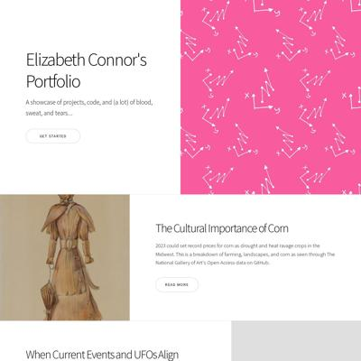](screenshots/scatterplotsandtea.github.io/portfolio-website_index.html-wide-full.jpg)|

### Automatic Checks

**https://scatterplotsandtea.github.io/portfolio-website/**

* Add a link to your project's GitHub repo, so people can review your code

## eculliford1.github.io

|url|mobile|medium|wide|
|---|---|---|---|
|[Elizabeth Culliford Project 1 Pubs](https://eculliford1.github.io/pubs11) :x: og:title :x: og:description :x: og:image [how to fix](https://jonathansoma.com/everything/web/social-tags/)||||

### Automatic Checks

**https://eculliford1.github.io/pubs11**

* Add a link to your project's GitHub repo, so people can review your code
* Image(s) need `alt` tags, [info here](https://abilitynet.org.uk/news-blogs/five-golden-rules-compliant-alt-text) and [tips here](https://twitter.com/FrankElavsky/status/1469023374529765385)
    * Image `deptford.png` missing `alt` tag
* Missing viewport meta tag in `<head>`, needed to tell browser it's responsive. Add `<meta name="viewport" content="width=device-width, initial-scale=1, shrink-to-fit=no">`

## efkodon.github.io

|url|mobile|medium|wide|
|---|---|---|---|
|[Emily Keller-O'Donnell's Website](https://efkodon.github.io/va-internet) :x: og:title :x: og:description :x: og:image [how to fix](https://jonathansoma.com/everything/web/social-tags/)||||

### Automatic Checks

**https://efkodon.github.io/va-internet**

No issues found! 🎉

## hannaakang.github.io

|url|mobile|medium|wide|
|---|---|---|---|
|[Los Angeles 1992 Riot Deaths](https://hannaakang.github.io/riot-deaths/) :x: og:title :x: og:description :x: og:image [how to fix](https://jonathansoma.com/everything/web/social-tags/)||||

### Automatic Checks

**https://hannaakang.github.io/riot-deaths/**

No issues found! 🎉

## federicodt.github.io

|url|mobile|medium|wide|
|---|---|---|---|
|[The illegal flights of the first lady of Argentina, during the Pandemic lockdown](http://federicodt.github.io/project1/)||||

### Automatic Checks

**http://federicodt.github.io/project1/**

* Has sideways scrollbars in mobile version – check padding, margins, image widths

## gavagliano.github.io

|url|mobile|medium|wide|
|---|---|---|---|
|[Giana Avagliano's Website](https://gavagliano.github.io/Project-1/) :x: og:title :x: og:description :x: og:image [how to fix](https://jonathansoma.com/everything/web/social-tags/)||||

### Automatic Checks

**https://gavagliano.github.io/Project-1/**

* Add a link to your project's GitHub repo, so people can review your code
* Change URL to be all in lowercase
* Missing viewport meta tag in `<head>`, needed to tell browser it's responsive. Add `<meta name="viewport" content="width=device-width, initial-scale=1, shrink-to-fit=no">`

## juditecypreste.com

|url|mobile|medium|wide|
|---|---|---|---|
|[Page not found · GitHub Pages](https://juditecypreste.com/portfolio-lede/project_1/project_1.html) :x: og:title :x: og:description :x: og:image [how to fix](https://jonathansoma.com/everything/web/social-tags/)|request failed|request failed|request failed|

### Automatic Checks

**https://juditecypreste.com/portfolio-lede/project_1/project_1.html**

* **Could not access the page** - if you moved it, let me know!
* All HTML files should be named `index.html`. If this is a personal project, move `portfolio-lede/project_1/project_1.html` into a folder (or repo) called `project_1`, then rename the file `index.html`. That way the project can be found at **/project_1** instead of **/project_1.html**. [Read more about index.html here](https://www.thoughtco.com/index-html-page-3466505) or how it works specifically with GitHub repos [on Fancy GitHub](https://jonathansoma.com/fancy-github/github-pages/#choosing-your-url)
* Change URL to use `-` instead of spaces or underscores
* Missing viewport meta tag in `<head>`, needed to tell browser it's responsive. Add `<meta name="viewport" content="width=device-width, initial-scale=1, shrink-to-fit=no">`
* Has sideways scrollbars in mobile version – check padding, margins, image widths

## idontknowhowcomputerswork.github.io

|url|mobile|medium|wide|
|---|---|---|---|
|[Website](https://idontknowhowcomputerswork.github.io/PROJECTS) :x: og:title :x: og:description :x: og:image [how to fix](https://jonathansoma.com/everything/web/social-tags/)||||

### Automatic Checks

**https://idontknowhowcomputerswork.github.io/PROJECTS**

* Add a link to your project's GitHub repo, so people can review your code
* Change URL to be all in lowercase
* Missing viewport meta tag in `<head>`, needed to tell browser it's responsive. Add `<meta name="viewport" content="width=device-width, initial-scale=1, shrink-to-fit=no">`

## winter-beard.github.io

|url|mobile|medium|wide|
|---|---|---|---|
|[Unplanned](https://winter-beard.github.io/) :x: og:title :x: og:description :x: og:image [how to fix](https://jonathansoma.com/everything/web/social-tags/)||||

### Automatic Checks

**https://winter-beard.github.io/**

No issues found! 🎉

## unoptimal.github.io

|url|mobile|medium|wide|
|---|---|---|---|
|[Magnus Carlsen's Chess Journey](https://unoptimal.github.io/magnus-journey/) :x: og:title :x: og:description :x: og:image [how to fix](https://jonathansoma.com/everything/web/social-tags/)||||

### Automatic Checks

**https://unoptimal.github.io/magnus-journey/**

* Has sideways scrollbars in mobile version – check padding, margins, image widths

## github.com

|url|mobile|medium|wide|
|---|---|---|---|
|[GitHub - krlmnz/Chile: Overview of Chilean trade and land used](https://github.com/krlmnz/Chile)|[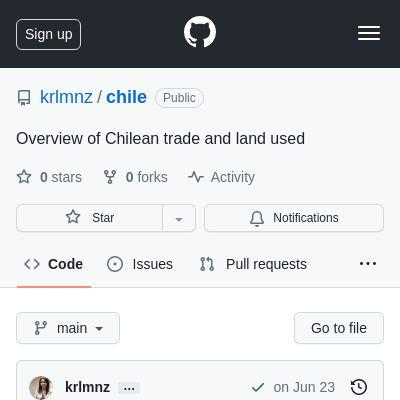](screenshots/github.com/krlmnz_Chile_index.html-mobile-full.jpg)|||
|[GitHub - kesa-w/Lede2023.P1](https://github.com/kesa-w/Lede2023.P1.git)|||[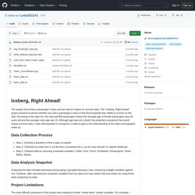](screenshots/github.com/kesa-w_Lede2023.P1.git_index.html-wide-full.jpg)|

### Automatic Checks

**https://github.com/krlmnz/Chile**

* Change URL to be all in lowercase

**https://github.com/kesa-w/Lede2023.P1.git**

* Change URL to be all in lowercase

## nguyenkim.ca

|url|mobile|medium|wide|
|---|---|---|---|
|[Class, Sensibilities, and the Gilmore Girls Literary Canon](https://nguyenkim.ca/data-viz/gg/gilmores) :x: og:title :x: og:description :x: og:image [how to fix](https://jonathansoma.com/everything/web/social-tags/)||||

### Automatic Checks

**https://nguyenkim.ca/data-viz/gg/gilmores**

No issues found! 🎉

## krystalwon.github.io

|url|mobile|medium|wide|
|---|---|---|---|
|[Data story with flourish](https://krystalwon.github.io/environmental-docus-in-netflix/) :x: og:title :x: og:description :x: og:image [how to fix](https://jonathansoma.com/everything/web/social-tags/)||||

### Automatic Checks

**https://krystalwon.github.io/environmental-docus-in-netflix/**

* Add a link to your project's GitHub repo, so people can review your code
* Has sideways scrollbars in mobile version – check padding, margins, image widths

## lei10003.github.io

|url|mobile|medium|wide|
|---|---|---|---|
|[Site not found · GitHub Pages](https://lei10003.github.io/Cellar-Defenders/) :x: og:title :x: og:description :x: og:image [how to fix](https://jonathansoma.com/everything/web/social-tags/)|request failed|request failed|request failed|

### Automatic Checks

**https://lei10003.github.io/Cellar-Defenders/**

* **Could not access the page** - if you moved it, let me know!
* Change URL to be all in lowercase
* Missing viewport meta tag in `<head>`, needed to tell browser it's responsive. Add `<meta name="viewport" content="width=device-width, initial-scale=1, shrink-to-fit=no">`
* Has sideways scrollbars in mobile version – check padding, margins, image widths

## medievalmadeline.github.io

|url|mobile|medium|wide|
|---|---|---|---|
|[Site not found · GitHub Pages](https://medievalmadeline.github.io/Website/) :x: og:title :x: og:description :x: og:image [how to fix](https://jonathansoma.com/everything/web/social-tags/)|request failed|request failed|request failed|

### Automatic Checks

**https://medievalmadeline.github.io/Website/**

* **Could not access the page** - if you moved it, let me know!
* Change URL to be all in lowercase
* Missing viewport meta tag in `<head>`, needed to tell browser it's responsive. Add `<meta name="viewport" content="width=device-width, initial-scale=1, shrink-to-fit=no">`
* Has sideways scrollbars in mobile version – check padding, margins, image widths

## marinav13.github.io

|url|mobile|medium|wide|
|---|---|---|---|
|[MA Pandemic Job Loss](https://marinav13.github.io/MyProject/) :x: og:title :x: og:description :x: og:image [how to fix](https://jonathansoma.com/everything/web/social-tags/)||||

### Automatic Checks

**https://marinav13.github.io/MyProject/**

* Image(s) need `alt` tags, [info here](https://abilitynet.org.uk/news-blogs/five-golden-rules-compliant-alt-text) and [tips here](https://twitter.com/FrankElavsky/status/1469023374529765385)
    * Image `mass1.png` missing `alt` tag
* Change URL to be all in lowercase

## marcodallastella.github.io

|url|mobile|medium|wide|
|---|---|---|---|
|[Page not found · GitHub Pages](https://marcodallastella.github.io/swimming) :x: og:title :x: og:description :x: og:image [how to fix](https://jonathansoma.com/everything/web/social-tags/)|request failed|request failed|request failed|

### Automatic Checks

**https://marcodallastella.github.io/swimming**

* **Could not access the page** - if you moved it, let me know!
* Missing viewport meta tag in `<head>`, needed to tell browser it's responsive. Add `<meta name="viewport" content="width=device-width, initial-scale=1, shrink-to-fit=no">`
* Has sideways scrollbars in mobile version – check padding, margins, image widths

## margauxwrites.github.io

|url|mobile|medium|wide|
|---|---|---|---|
|[Out of time](https://margauxwrites.github.io/) :x: og:title :x: og:description :x: og:image [how to fix](https://jonathansoma.com/everything/web/social-tags/)||||

### Automatic Checks

**https://margauxwrites.github.io/**

* Add a link to your project's GitHub repo, so people can review your code
* Missing viewport meta tag in `<head>`, needed to tell browser it's responsive. Add `<meta name="viewport" content="width=device-width, initial-scale=1, shrink-to-fit=no">`
* Has sideways scrollbars in mobile version – check padding, margins, image widths

## mfhan.github.io

|url|mobile|medium|wide|
|---|---|---|---|
|[Queens and Crowns: The Royal Consort Conundrum](https://mfhan.github.io/project1/)||||

### Automatic Checks

**https://mfhan.github.io/project1/**

No issues found! 🎉

## mymo5303.github.io

|url|mobile|medium|wide|
|---|---|---|---|
|[Site not found · GitHub Pages](https://mymo5303.github.io/project01-Suicide/) :x: og:title :x: og:description :x: og:image [how to fix](https://jonathansoma.com/everything/web/social-tags/)|request failed|request failed|request failed|

### Automatic Checks

**https://mymo5303.github.io/project01-Suicide/**

* **Could not access the page** - if you moved it, let me know!
* Change URL to be all in lowercase
* Missing viewport meta tag in `<head>`, needed to tell browser it's responsive. Add `<meta name="viewport" content="width=device-width, initial-scale=1, shrink-to-fit=no">`
* Has sideways scrollbars in mobile version – check padding, margins, image widths

## meganmkim.github.io

|url|mobile|medium|wide|
|---|---|---|---|
|[Record High Book Ban in 2021-2022 Driven by Four States](https://meganmkim.github.io/usbannedbooks/) :x: og:title :x: og:description :x: og:image [how to fix](https://jonathansoma.com/everything/web/social-tags/)||||

### Automatic Checks

**https://meganmkim.github.io/usbannedbooks/**

* Datawrapper chart missing description, fill out *Alternative description for screen readers* section on Annotate tab, [tips here](https://twitter.com/FrankElavsky/status/1469023374529765385)

## mizuhomorioka.github.io

|url|mobile|medium|wide|
|---|---|---|---|
|[Mizuho Morioka's Website](https://mizuhomorioka.github.io/first_project/) :x: og:title :x: og:description :x: og:image [how to fix](https://jonathansoma.com/everything/web/social-tags/)||||

### Automatic Checks

**https://mizuhomorioka.github.io/first_project/**

* Image(s) need `alt` tags, [info here](https://abilitynet.org.uk/news-blogs/five-golden-rules-compliant-alt-text) and [tips here](https://twitter.com/FrankElavsky/status/1469023374529765385)
    * Image `equality.jpg` missing `alt` tag
* Change URL to use `-` instead of spaces or underscores

## mollylongman.github.io

|url|mobile|medium|wide|
|---|---|---|---|
|[Molly Longman's Incredible Website For Her First Lede Project](https://mollylongman.github.io/barbie-careers/) :x: og:title :x: og:description :x: og:image [how to fix](https://jonathansoma.com/everything/web/social-tags/)||||

### Automatic Checks

**https://mollylongman.github.io/barbie-careers/**

* Add a link to your project's GitHub repo, so people can review your code
* Missing viewport meta tag in `<head>`, needed to tell browser it's responsive. Add `<meta name="viewport" content="width=device-width, initial-scale=1, shrink-to-fit=no">`

## muimran.github.io

|url|mobile|medium|wide|
|---|---|---|---|
|[spices](https://muimran.github.io/) :x: og:title :x: og:description :x: og:image [how to fix](https://jonathansoma.com/everything/web/social-tags/)||||

### Automatic Checks

**https://muimran.github.io/**

No issues found! 🎉

## nam-sgn327.github.io

|url|mobile|medium|wide|
|---|---|---|---|
|[Weightlifting on the 'gram](https://nam-sgn327.github.io/weightlifters/)||||

### Automatic Checks

**https://nam-sgn327.github.io/weightlifters/**

No issues found! 🎉

## namu-sampath.github.io

|url|mobile|medium|wide|
|---|---|---|---|
|[project-01/index.html](https://namu-sampath.github.io/project-01) :x: og:title :x: og:description :x: og:image [how to fix](https://jonathansoma.com/everything/web/social-tags/)||||

### Automatic Checks

**https://namu-sampath.github.io/project-01**

* Needs a title, add a `<title>` tag to the `<head>`
* Add a link to your project's GitHub repo, so people can review your code
* Missing viewport meta tag in `<head>`, needed to tell browser it's responsive. Add `<meta name="viewport" content="width=device-width, initial-scale=1, shrink-to-fit=no">`
* Has sideways scrollbars in mobile version – check padding, margins, image widths

## niallsimonian.github.io

|url|mobile|medium|wide|
|---|---|---|---|
|[Project 1](https://niallsimonian.github.io/LedeProjects/) :x: og:title :x: og:description :x: og:image [how to fix](https://jonathansoma.com/everything/web/social-tags/)||||

### Automatic Checks

**https://niallsimonian.github.io/LedeProjects/**

* Change URL to be all in lowercase
* Missing viewport meta tag in `<head>`, needed to tell browser it's responsive. Add `<meta name="viewport" content="width=device-width, initial-scale=1, shrink-to-fit=no">`
* Has sideways scrollbars in mobile version – check padding, margins, image widths

## github.com

|url|mobile|medium|wide|
|---|---|---|---|
|[GitHub - pilartms/rape-data](https://github.com/pilartms/rape-data)|||[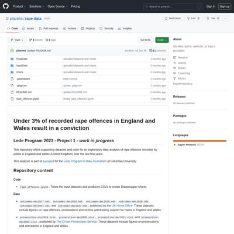](screenshots/github.com/pilartms_rape-data_index.html-wide-full.jpg)|

### Automatic Checks

**https://github.com/pilartms/rape-data**

No issues found! 🎉

## prachivashishtt.github.io

|url|mobile|medium|wide|
|---|---|---|---|
|[Government Requests From Meta on a Rise](https://prachivashishtt.github.io/Vashisht_Meta_Lede/) :x: og:title :x: og:description :x: og:image [how to fix](https://jonathansoma.com/everything/web/social-tags/)||||

### Automatic Checks

**https://prachivashishtt.github.io/Vashisht_Meta_Lede/**

* Change URL to use `-` instead of spaces or underscores
* Change URL to be all in lowercase

## sinderskir.github.io

|url|mobile|medium|wide|
|---|---|---|---|
|[How did Brazilian Politicians Approach January 8th on Twitter?](https://sinderskir.github.io/project1_jan8/) :x: og:title :x: og:description :x: og:image [how to fix](https://jonathansoma.com/everything/web/social-tags/)||||

### Automatic Checks

**https://sinderskir.github.io/project1_jan8/**

* Add a link to your project's GitHub repo, so people can review your code
* Change URL to use `-` instead of spaces or underscores
* Has sideways scrollbars in mobile version – check padding, margins, image widths

## rajitsengupta.github.io

|url|mobile|medium|wide|
|---|---|---|---|
|[Rajit Sengupta's Project](https://rajitsengupta.github.io/browsing_history_project/) :x: og:title :x: og:description :x: og:image [how to fix](https://jonathansoma.com/everything/web/social-tags/)||||

### Automatic Checks

**https://rajitsengupta.github.io/browsing_history_project/**

* Add a link to your project's GitHub repo, so people can review your code
* Datawrapper chart missing description, fill out *Alternative description for screen readers* section on Annotate tab, [tips here](https://twitter.com/FrankElavsky/status/1469023374529765385)
* Datawrapper chart missing description, fill out *Alternative description for screen readers* section on Annotate tab, [tips here](https://twitter.com/FrankElavsky/status/1469023374529765385)
* Change URL to use `-` instead of spaces or underscores
* Has sideways scrollbars in mobile version – check padding, margins, image widths

## reliablerascal.github.io

|url|mobile|medium|wide|
|---|---|---|---|
|[Who's Still Riding CTA Trains?](https://reliablerascal.github.io/cta_ridership/) :x: og:title :x: og:description :x: og:image [how to fix](https://jonathansoma.com/everything/web/social-tags/)||||

### Automatic Checks

**https://reliablerascal.github.io/cta_ridership/**

* Change URL to use `-` instead of spaces or underscores
* Missing viewport meta tag in `<head>`, needed to tell browser it's responsive. Add `<meta name="viewport" content="width=device-width, initial-scale=1, shrink-to-fit=no">`

## celyvelez.github.io

|url|mobile|medium|wide|
|---|---|---|---|
|[Sara Cely - Lede Project 01](https://celyvelez.github.io/lede-2023/project-01/) :x: og:title :x: og:description :x: og:image [how to fix](https://jonathansoma.com/everything/web/social-tags/)||||

### Automatic Checks

**https://celyvelez.github.io/lede-2023/project-01/**

No issues found! 🎉

## seulgijung.github.io

|url|mobile|medium|wide|
|---|---|---|---|
|[Seulgi Jung's project 01](https://seulgijung.github.io/project01/) :x: og:title :x: og:description :x: og:image [how to fix](https://jonathansoma.com/everything/web/social-tags/)||||

### Automatic Checks

**https://seulgijung.github.io/project01/**

* Add a link to your project's GitHub repo, so people can review your code
* Missing viewport meta tag in `<head>`, needed to tell browser it's responsive. Add `<meta name="viewport" content="width=device-width, initial-scale=1, shrink-to-fit=no">`

## sho-miyasaka.github.io

|url|mobile|medium|wide|
|---|---|---|---|
|[More Japanese Feel a Renewed Affinity for South Korea](https://sho-miyasaka.github.io/project-01/) :x: og:title :x: og:description :x: og:image [how to fix](https://jonathansoma.com/everything/web/social-tags/)||||

### Automatic Checks

**https://sho-miyasaka.github.io/project-01/**

No issues found! 🎉

## jellomoat.github.io

|url|mobile|medium|wide|
|---|---|---|---|
|[Profiles of the Many Dramatically Different Yogurts at Whole Foods](https://jellomoat.github.io/yogurts/) :x: og:title :x: og:description :x: og:image [how to fix](https://jonathansoma.com/everything/web/social-tags/)|[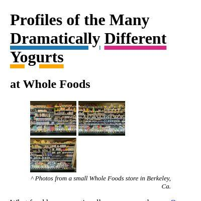](screenshots/jellomoat.github.io/yogurts_index.html-mobile-full.jpg)|||

### Automatic Checks

**https://jellomoat.github.io/yogurts/**

* Missing viewport meta tag in `<head>`, needed to tell browser it's responsive. Add `<meta name="viewport" content="width=device-width, initial-scale=1, shrink-to-fit=no">`

## tejalwakchoure.github.io

|url|mobile|medium|wide|
|---|---|---|---|
|[So you think you can Broadway?](https://tejalwakchoure.github.io/broadway)||||

### Automatic Checks

**https://tejalwakchoure.github.io/broadway**

No issues found! 🎉

## yikemats.github.io

|url|mobile|medium|wide|
|---|---|---|---|
|[Is Elon Musk Devil or Angel?](https://yikemats.github.io/project1/) :x: og:title :x: og:description :x: og:image [how to fix](https://jonathansoma.com/everything/web/social-tags/)|||[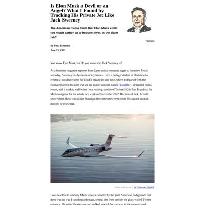](screenshots/yikemats.github.io/project1_index.html-wide-full.jpg)|

### Automatic Checks

**https://yikemats.github.io/project1/**

* Image(s) need `alt` tags, [info here](https://abilitynet.org.uk/news-blogs/five-golden-rules-compliant-alt-text) and [tips here](https://twitter.com/FrankElavsky/status/1469023374529765385)
    * Image `ElonJet.jpg` missing `alt` tag

## karinashed.github.io

|url|mobile|medium|wide|
|---|---|---|---|
|[NYC Taxi Riders Are Still Decent Tippers](https://karinashed.github.io/nyc-yellow-taxi-rides/) :x: og:title :x: og:description :x: og:image [how to fix](https://jonathansoma.com/everything/web/social-tags/)|||[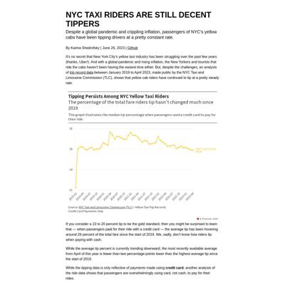](screenshots/karinashed.github.io/nyc-yellow-taxi-rides_index.html-wide-full.jpg)|

### Automatic Checks

**https://karinashed.github.io/nyc-yellow-taxi-rides/**

* Add a link to your project's GitHub repo, so people can review your code

## bique2002.github.io

|url|mobile|medium|wide|
|---|---|---|---|
|[Road Fatality Statistics](https://bique2002.github.io/LEDE-P1-Road-Fatalities-2018/) :x: og:title :x: og:description :x: og:image [how to fix](https://jonathansoma.com/everything/web/social-tags/)||||

### Automatic Checks

**https://bique2002.github.io/LEDE-P1-Road-Fatalities-2018/**

* Image(s) need `alt` tags, [info here](https://abilitynet.org.uk/news-blogs/five-golden-rules-compliant-alt-text) and [tips here](https://twitter.com/FrankElavsky/status/1469023374529765385)
    * Image `Images/road-accidents.jpg` missing `alt` tag
    * Image `2018 Drivers Killed.png` missing `alt` tag
* Change URL to be all in lowercase
* Missing viewport meta tag in `<head>`, needed to tell browser it's responsive. Add `<meta name="viewport" content="width=device-width, initial-scale=1, shrink-to-fit=no">`
* Has sideways scrollbars in mobile version – check padding, margins, image widths

